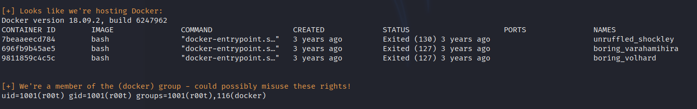

<!DOCTYPE html  PUBLIC '-//W3C//DTD XHTML 1.0 Transitional//EN'  'http://www.w3.org/TR/xhtml1/DTD/xhtml1-transitional.dtd'><html xmlns="http://www.w3.org/1999/xhtml">
<head>
<meta content="text/html; charset=utf-8" http-equiv="Content-Type"/>
<title>Docker</title>
</head><body>Escaliation by docker... 
 
 
well fek! 
 
TLDR. 
 
 
get onto machine.. 
 
Identify that you are hosting docker 
 
IDentify that you are a member of the docker group 
 
Spawn a docker instance at root. 
 
Use an enumartion tool... Ie Linenum to speed this up. 
 
 
 
 
From here head on over to GTFO bins and see what can be done with the docker tools avaliable 
 
 
 
 
 
We meet these conditions 
 
docker run -v /:/mnt --rm -it &lt;image&gt; chroot /mnt sh  
 
 
 
</body></html>