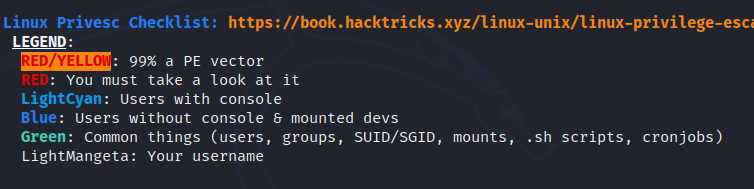

<!DOCTYPE html  PUBLIC '-//W3C//DTD XHTML 1.0 Transitional//EN'  'http://www.w3.org/TR/xhtml1/DTD/xhtml1-transitional.dtd'><html xmlns="http://www.w3.org/1999/xhtml">
<head>
<meta content="text/html; charset=utf-8" http-equiv="Content-Type"/>
<title>Enumeration - automated tools</title>
</head><body>Enumeration - Automated toolsUpdate 
 
Run multiple tools, they might hit different thigns 
 
 
<b>linPEAS</b>- Heaths fav. linux vuln scanner, enumeration tools 
 
<b>Linenum.sh</b>- similar to linpeas 
 
<b>Linux-exploit-suggester</b> 
 
<b>linuxprivchecker.py 
 
 
 
Tools 
 
</b><b>Linpeas</b> 
 
run <b>./linpeas.sh 
</b><b> 
</b> 
 
Always look into Red/Yellow and RED. start there 
 
gives lots of general info. linpease auto runs the manualk enum scans 
 
 
 
 
 
 
 
 
 
BE careful. sometimes critical info wont be highlighted. heres a password. 
 
 
 
 
 
 
Note linenum is fast 
 
</body></html>