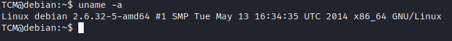

<!DOCTYPE html  PUBLIC '-//W3C//DTD XHTML 1.0 Transitional//EN'  'http://www.w3.org/TR/xhtml1/DTD/xhtml1-transitional.dtd'><html xmlns="http://www.w3.org/1999/xhtml">
<head>
<meta content="text/html; charset=utf-8" http-equiv="Content-Type"/>
<title>Kernal exploit</title>
</head><body><b>Kernal exploit</b> 
 
uname -a is manual method. 
 
 
 
Punch <b>Linux debian 2.6.32-5-amd64</b>into google 
 
https://www.exploit-db.com/exploits/40839 
 
Linux_exploit_suggester will also ID potential exploit 
 
Get the exploit onto the machine and compile 
 
 
<b>gcc -pthread c0w.c -o cow</b> 
 
This will work and land back as unpriveldged user. 
 
It overwrites teh /usr/bin/passwd 
 
entering the command &quot;passwd&quot; will execute it 
 
 
 
 
there are variations, whcih will dictate how its compiled and exected. 
 
This isu how Kernal exploits work 
 
ID the Kernaal version. 
Find a likely exploit 
upload and execute 
 
When done. be sure toi undo changes by restoring the original file 
<b>cp /tmp/bak /usr/bin/passwd</b> 
 
 
 
 
 
</body></html>