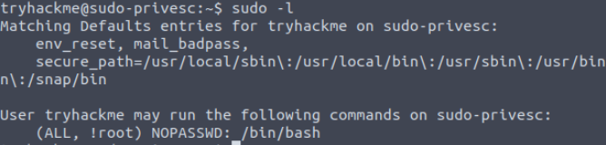

<!DOCTYPE html  PUBLIC '-//W3C//DTD XHTML 1.0 Transitional//EN'  'http://www.w3.org/TR/xhtml1/DTD/xhtml1-transitional.dtd'><html xmlns="http://www.w3.org/1999/xhtml">
<head>
<meta content="text/html; charset=utf-8" http-equiv="Content-Type"/>
<title>CVE-2019-14287</title>
</head><body>Escalation via CVE-2019-14287 
 
MITRE - In Sudo before 1.8.28, an attacker with access to a Runas ALL sudoer account can bypass certain policy blacklists and session PAM modules, and can cause incorrect logging, by invoking sudo with a crafted user ID. For example, this allows bypass of !root configuration, and USER= logging, for a &quot;sudo -u \#$((0xffffffff))&quot; command.  
 
Performing sudo action using another user ID... but setting it to -1 which = 0 which is root 
Soo ALL is commands as antoher user but !root... until -1 = 0 
 
check for with <b>sudo -l</b> 
 
looking for (ALL, !root) /bin/bash 
 
 
 
<b>sudo -u#-1 /bin/bash</b> 
 
</body></html>