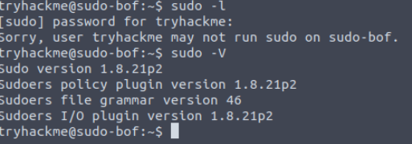

<!DOCTYPE html  PUBLIC '-//W3C//DTD XHTML 1.0 Transitional//EN'  'http://www.w3.org/TR/xhtml1/DTD/xhtml1-transitional.dtd'><html xmlns="http://www.w3.org/1999/xhtml">
<head>
<meta content="text/html; charset=utf-8" http-equiv="Content-Type"/>
<title>CVE-2019-18634</title>
</head><body>Escilation via CVE-2019-18634 
 
MITRE - In Sudo before 1.8.26, if pwfeedback is enabled in /etc/sudoers, users can trigger a stack-based buffer overflow in the privileged sudo process. (pwfeedback is a default setting in Linux Mint and elementary OS; however, it is NOT the default for upstream and many other packages, and would exist only if enabled by an administrator.) The attacker needs to deliver a long string to the stdin of getln() in tgetpass.c.   
 
 
Take advantage of the <b>pwfeedback</b>envioronmental variable being turned on. give the littel *** when entering passwords instead of blank. 
 
 
Ways to ID. 
 
<b>sudo -l</b> 
 
<b>cat /etc/sudoers</b> 
 
<b>sudo -V</b>and then check the version for exploits 
 
or try switch users and get a password prompt and look for <b>******</b> 
 
 
 
 
 
exploits available 
 
google sudo version number. 
</body></html>