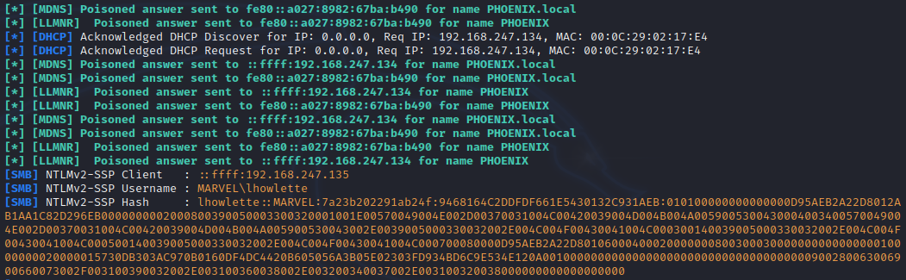

**Attacking AD - Initla Vectors**
 
Inital attempts to attack AD 
 
Have to find a wat into the network 
 
abuse windows features 
 
Heaths reccomended article 
https://adam-toscher.medium.com/top-five-ways-i-got-domain-admin-on-your-internal-network-before-lunch-2018-edition-82259ab73aaa 
 
 
 
ATTACKS 
 
LLMNR POISONING 
link local multi name resolution 
basically DNS when DNS fails 
 
 
What is it - used to ID hosts when DNS fails 
 
key flaw - uses a user's username and NTLMv2 hash when appropriatly responded to 
 
 
Basic overview.. a request is sent from victim to the server asking to connect to a source 
server doesnt know what/where... 
 
Victim broadcasts request for connect to service 
 
Attacker conducting a MitM attack responds and requests creds on premise it will connect 
 
Uses RESPONDER 
 
Best to run early morning or post lunch. requires a lot of traffic 
 
Hashs are captured 
 
HASHCAT to attempt to crack 
 
 
CONDUCTING THE ATTACK 
 
boot repsonder 
 
syntax &gt; sudo responder -I eht0 -rdwv  
 
Forcing traffic from victim to attacker (to generate some capturabel traffic) 
 
results in win 
 
 
 
Normal circumstances... wait and MitM 
 
Time to crack HASHCAT 
 
-m 5600 + NetNTLMv2 
 
--force to force it to run despite being in a vm adn using CPU 
 
I was lucky and mine ran. YOu should run on base OS and use GPU. Hashcat can be downloaded for windows 
 
 
 
 
windows &gt; run in comand prompt as admin 
 
syntax &gt; &lt;exe name&gt;.exe -m &lt;module no&gt; &lt;hash file&gt; &lt;wordlist file&gt; -O 
 
 
LLMNR Poisoning Defenses 
 
 
Turn off LLMNR AND NBT-NS (NBT-NS is the back up for when LLMNR fails) 
 
If cant or wont disable LLMNR 
 
Then enable Network access control... 
MAC whitelisting 
 
Strong password policy ENFORCED 
 
