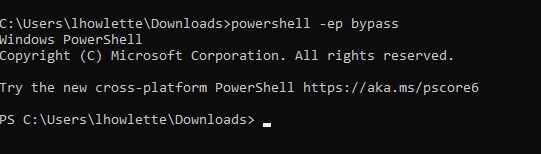

**PowerView**
POWERVIEW &gt; Enumerate the network after compromise with initial vectors 
 
Once a machine has been compromised, you would install powerview to run it from the compromised machine 
With access you could possible transfer the file to or download it. 
 
 
CHEAT SHEET 
https://gist.github.com/HarmJ0y/184f9822b195c52dd50c379ed3117993 
 
 
 
 
DOMAIN ENUMERATION 
 
open cmd prompt then from file location of powerview open powershell with exectuion bypass. (EP is desgined to prevent accidently running scripts you may not intend to) 
 
syntax &gt; powershell -ep bypass 
 
 
 
NOTE &gt; Windows Defenders will detect it being run in PS... 
 
Bypass trhough obsfucation or tunr of AV 
 
 
 
 
 
 
 
We now hoave the IP of the Domain Controller 
192.168.247.133 
 
LETS LEARN SOME THINGS 
 
 
 
 
To get further details &gt;&gt;&gt; 
 
 
 
 
Net user can dump alot of information. The bigger teh corporation the more data. Try grepping 
 
Get-NetUser | select cn 
Get-NetUser | select samaccountname 
etc 
 
Get-UserProperty - Properties pwdlastset<ul><li style="list-style-type: none">gets a date for the last time a suser dset their password... arte their old passowrds/accounts arround</li>
<li style="list-style-type: none"/>
</ul>
 
Get-UserProperty - Properties logoncount 
<ul><li style="list-style-type: none">if a user has never logged in it may be a honey pot account... dont touch</li>
</ul>
 
 
 
 
 
 
This tool is HUGE!!!! play with all the features.... Looks like some commands have changed since courcese amterail was made 
 
As above... in course.. it was XYZ -GroupName XYZ 
now XYZ -Name XYZ 
 
 
 
