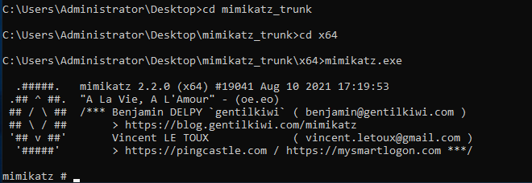

**MIMIKATZ**

MIMIKATZ 
 
 
Tool used to view and steal creds form memory, generate kerberos tickets, and leverage attacks. 
 
Dumps creds stored in memory 
 
SOME ATTACKS 
Cred dumping 
pass-the-hash 
over-pass-the-hash 
pass-the-ticket 
golden-ticket 
silver-ticket 
 
 
 
Reference 
 
https://github.com/gentilkiwi/mimikatz 
 
 
NOTE &gt;&gt; back and forth battle between mimikatz deve and windows... 
sometimes it wont work until its patched 
 
This refernce is for the version that does not need to be compiled 
https://github.com/gentilkiwi/mimikatz/releases 
 
This will be downloaded to the domain controller VM., its assumed we have compromiseed the machine and have the ability to upload/download files to the DC 
 
 
 
ATTACK 
 
 
extrack mimikatz 
 
in terminal navigate to mimkatz folders and execture 
 
mimikatz.exe 
 
 
 
First command to run 
 
privilege::debug 
 
this should return privilige '20' OK  
 
this indactes it works good to proceed. this tests that we have access to something we shouldnt under normal conditions 
 
first part of command is the module 
 
next attack 
 
sekurlsa::logonpasswords 
 
 
 
This will return the computers ... computer names.. NTLM hases for computers.. and logons of anyone who has logged on since last reboot. 
 
Provides NTLM hashes.. these can be passed around 
 
Admin has logged in.. we have the NTLM 
 
wdigest is worht checking 
we can turn it on... necxt time the user logs in it will record the password in plain. 
 
 
Next command 
 
lsadump::sam failed 
 
Next comand 
 
lsadump::lsa /patch 
 
dumps user names and ntlm hashes from the local security authority 
 
LSA - protected subsystem in window authenticatios.. it authenticates and createsds logon connectsion to the local computer 
 
 
we have user names and ntlms 
 
we can try crack the passwords 
 
what % can we crack.. pass this onto the client give metrics 
 
Also can lead to golden ticket attack 
 
 
