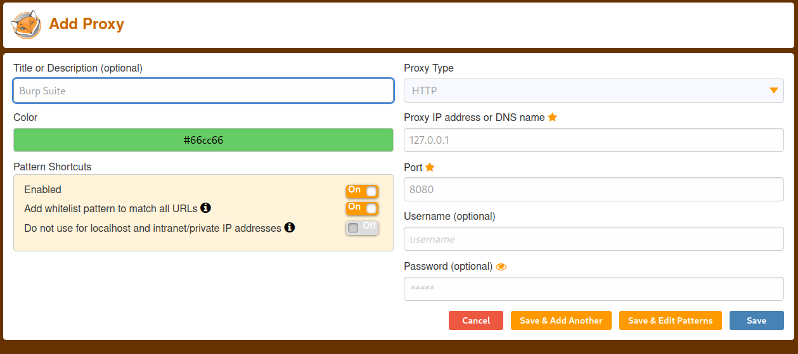

**Password spraying and Credential Stuffing**

During passive recon, credentails can be gathered through various tool and collated into a list.  
THese crednetials have been obtained and collated through previous breeches of various services. 
Searching through and filtering down to the company being targets can provide infomration on format of login crednetials and potentailly common or reused passwords. IE &lt;season&gt;&lt;year&gt;. 
Some stolen credentials may even still work in the system. 
 
During the course, tesla.com is used. as such, this exercise will not be executed. Steps up to execution will be covered. 
 
 
Step 1 have foxy proxy installed to make use of Burpsuite easier 
 
Set up proxy for burp 
 
 
 
Steps to conduct attack 
 
1. navigate to site to attack and open login page 
2. run burpsuite, set proxy and intercept traffic 
3. enter randome fake email and password &gt; sign in 
4. burp will capture the packet. 
- user= and password= will be seen. 
5. send that packet to the intruder (right click &gt; send to intruder) 
6. Select positions and clear it (clear button) postions tries to auto guess the parameters 
7. highlight the email and click add 
8. highlight the password click add 
9. chacnge atack type from snipe to pitchfork (sniper uses a single parameter, pitchfor... assumed up to 3 - OR pitchfor runs payload 1 with payload 2... so username and password are matched) 
10. Navigate to payloads 
11. payload 1 &gt; copy list of users (email) and past into simple list 
12. set payload set to 2. Copy list of passwords into simlpe list 
13. click run! ignor the warning on free version 
14. results in real time. looking for status code changes 
15. also check actual responce. you could use a grep options... Ie a messege return &quot;we could not log you in&quot; allow for quicker scruitny. 
 
 
PASSWORD SPRAYING 
 
obtain all the breached credentials during recon 
list the user names... enter or use common passowords.. IE fall2022! 
NOTE &gt; always ask or check with client aboujt lock out. a user could be locked out based on number of inccorect guesses. DO not do this 
dp 1 or 2 then wait a few hours if you must 
 
NOTE &gt; CRED STUFFING AND PASSWORD SPRAYING IS THE MOST COMMON WAY OF GETTIN IN ON EXT PEN TEST
