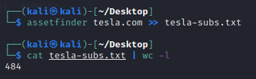

#additional enumeration tools

**ADDITIONAL WEBAPP ENUMERATION
 
You need GoLang! 
 
Install ASSETFINDER 
 
https://github.com/tomnomnom/assetfinder 
 
 
 
 
asset finder will find assets loosely related to the search which can add alot of overhead. 
 
use --subs-only to keep it tied to the specific search 
 
 
 
almost half 
 
AUTOMATION stage 1 
<ul><i><li style="list-style-type: none">#!/bin/bash</li>
<li style="list-style-type: none"></li>
<li style="list-style-type: none">url=$1</li>
<li style="list-style-type: none"></li>
<li style="list-style-type: none">if [ ! -d "$url" ]; then</li>
<li style="list-style-type: none">&#09;mkdir $url</li>
<li style="list-style-type: none">fi</li>
<li style="list-style-type: none"></li>
<li style="list-style-type: none">if [ ! -d "$url/recon" ]; then</li>
<li style="list-style-type: none">&#09;mkdir $url/recon</li>
<li style="list-style-type: none">fi</li>
<li style="list-style-type: none"></li>
<li style="list-style-type: none">echo "[+] Harvesting subdomains with assetfinder..."</li>
<li style="list-style-type: none">assetfinder $url &gt;&gt; $url/recon/assets.txt</li>
<li style="list-style-type: none">cat $url/recon/assets.txt | grep $1 &gt;&gt; $url/recon/final.txt</li>
</i><li style="list-style-type: none"><i>rm $url/recon/assets.txt</i></li>
</ul>
 
 
Automating assetfinder with a grep to remove subdomains associated with the url 
 
 
 
AMASS  
 
DAMN THIS IS SLOW 
 
Different tools enumerate digferntly and can find differnt subdaomains... dont limit yourself 
 
https://github.com/OWASP/Amass 
 
Differnce to video ... amas can be istalled with apt-get 
 
 
APPEND TO BOTTOM OF PREVIOUS SCRIPT 
 
<ul><i><li style="list-style-type: none">#echo "[+] Harvesting subdomains with Amass..."</li>
<li style="list-style-type: none">#amass enum -d $url &gt;&gt; $url/recon/f.txt</li>
<li style="list-style-type: none">#sort -u $url/recon/f.txt &gt;&gt; $url/recon/final.txt</li>
<li style="list-style-type: none">#rm $url/recon/f.txt</li>
</i><li style="list-style-type: none"></li>
</ul>
 
HTTPROBE 
 
All good having a list of potential urls... but are they alive... 
 
https://github.com/tomnomnom/httprobe 
 
README is out of date... use 
go install github.com/tomnomnom/httprobe@master 
 
 
Stage 3 script 
<ul><i><li style="list-style-type: none">#!/bin/bash</li>
<li style="list-style-type: none"></li>
<li style="list-style-type: none">url=$1</li>
<li style="list-style-type: none"></li>
<li style="list-style-type: none">if [ ! -d "$url" ]; then</li>
<li style="list-style-type: none">&#09;mkdir $url</li>
<li style="list-style-type: none">fi</li>
<li style="list-style-type: none"></li>
<li style="list-style-type: none">if [ ! -d "$url/recon" ]; then</li>
<li style="list-style-type: none">&#09;mkdir $url/recon</li>
<li style="list-style-type: none">fi</li>
<li style="list-style-type: none"></li>
<li style="list-style-type: none">echo "[+] Harvesting subdomains with assetfinder..."</li>
<li style="list-style-type: none">assetfinder $url &gt;&gt; $url/recon/assets.txt</li>
<li style="list-style-type: none">cat $url/recon/assets.txt | grep $1 &gt;&gt; $url/recon/final.txt</li>
<li style="list-style-type: none">rm $url/recon/assets.txt</li>
<li style="list-style-type: none"></li>
<li style="list-style-type: none">#echo "[+] Harvesting subdomains with Amass..."</li>
<li style="list-style-type: none">#amass enum -d $url &gt;&gt; $url/recon/f.txt</li>
<li style="list-style-type: none">#sort -u $url/recon/f.txt &gt;&gt; $url/recon/final.txt</li>
<li style="list-style-type: none">#rm $url/recon/f.txt</li>
<li style="list-style-type: none"></li>
<li style="list-style-type: none">echo "[+] Probing for alive domains..."</li>
</i><li style="list-style-type: none"><i>cat $url/recon/final.txt | sort -u | httprobe -s -p https:443 | sed 's/https\?:\/\///' | tr -d ':443' &gt;&gt; $url/recon/alive.txt</i></li>
</ul>
 
 
Feed the final list into http probe after sorting for unique entries. ping on port 443 ... trim off the http and :443 so this can be used later in NMAP 
 
After A LOT of issues with httprobe command not found erros. 
RUN 
sudo apt install httprobe  
and it will work just fine 
so do the github install then just install using apt install. 
 
Note &gt; script is slow.. usut wait it out 
 
 
 
GOWITNESS.. 
 
also pywitness and eyewitness... all basically the same tool differnt languages 
 
It takes a screenshot of the website.. 
 
https://github.com/sensepost/gowitness 
 
You need this depoendancy before install 
go get -u gorm.io/gorm  
 
INSTALLATION GUIDE 
https://github.com/sensepost/gowitness/wiki/Installation 
 
Tool can enumerate through a list of websites and take a screenshot of the page... allows visual enumeration and record keeping.. 
Sometimes image wont caputre. rerunning will update the image 
 
install is broken  
try 
sudo go get -u github.com/sensepost/gowitness@master 
 
Didnt work for me at this time 
 
OK to make it work you need google chrome installed.. It should default to Mozzila, however my install did not and the flags failed to fix it.  
 
installing chrome did 
 
 
 
 
FINAL NOTE... 
 
This is Heath Adams' Automation script... Juicy 
<ul><i><li style="list-style-type: none">!/bin/bash</li>
<li style="list-style-type: none"></li>
<li style="list-style-type: none">url=$1</li>
<li style="list-style-type: none">if [ ! -d "$url" ];then</li>
<li style="list-style-type: none">&nbsp; &nbsp; mkdir $url</li>
<li style="list-style-type: none">fi</li>
<li style="list-style-type: none">if [ ! -d "$url/recon" ];then</li>
<li style="list-style-type: none">&nbsp; &nbsp; mkdir $url/recon</li>
<li style="list-style-type: none">fi</li>
<li style="list-style-type: none"># &nbsp; &nbsp;if [ ! -d '$url/recon/eyewitness' ];then</li>
<li style="list-style-type: none"># &nbsp; &nbsp; &nbsp; &nbsp;mkdir $url/recon/eyewitness</li>
<li style="list-style-type: none"># &nbsp; &nbsp;fi</li>
<li style="list-style-type: none">if [ ! -d "$url/recon/scans" ];then</li>
<li style="list-style-type: none">&nbsp; &nbsp; mkdir $url/recon/scans</li>
<li style="list-style-type: none">fi</li>
<li style="list-style-type: none">if [ ! -d "$url/recon/httprobe" ];then</li>
<li style="list-style-type: none">&nbsp; &nbsp; mkdir $url/recon/httprobe</li>
<li style="list-style-type: none">fi</li>
<li style="list-style-type: none">if [ ! -d "$url/recon/potential_takeovers" ];then</li>
<li style="list-style-type: none">&nbsp; &nbsp; mkdir $url/recon/potential_takeovers</li>
<li style="list-style-type: none">fi</li>
<li style="list-style-type: none">if [ ! -d "$url/recon/wayback" ];then</li>
<li style="list-style-type: none">&nbsp; &nbsp; mkdir $url/recon/wayback</li>
<li style="list-style-type: none">fi</li>
<li style="list-style-type: none">if [ ! -d "$url/recon/wayback/params" ];then</li>
<li style="list-style-type: none">&nbsp; &nbsp; mkdir $url/recon/wayback/params</li>
<li style="list-style-type: none">fi</li>
<li style="list-style-type: none">if [ ! -d "$url/recon/wayback/extensions" ];then</li>
<li style="list-style-type: none">&nbsp; &nbsp; mkdir $url/recon/wayback/extensions</li>
<li style="list-style-type: none">fi</li>
<li style="list-style-type: none">if [ ! -f "$url/recon/httprobe/alive.txt" ];then</li>
<li style="list-style-type: none">&nbsp; &nbsp; touch $url/recon/httprobe/alive.txt</li>
<li style="list-style-type: none">fi</li>
<li style="list-style-type: none">if [ ! -f "$url/recon/final.txt" ];then</li>
<li style="list-style-type: none">&nbsp; &nbsp; touch $url/recon/final.txt</li>
<li style="list-style-type: none">fi</li>
<li style="list-style-type: none">&nbsp;</li>
<li style="list-style-type: none">echo "[+] Harvesting subdomains with assetfinder..."</li>
<li style="list-style-type: none">assetfinder $url &gt;&gt; $url/recon/assets.txt</li>
<li style="list-style-type: none">cat $url/recon/assets.txt | grep $1 &gt;&gt; $url/recon/final.txt</li>
<li style="list-style-type: none">rm $url/recon/assets.txt</li>
<li style="list-style-type: none">&nbsp;</li>
<li style="list-style-type: none">#echo "[+] Double checking for subdomains with amass..."</li>
<li style="list-style-type: none">#amass enum -d $url &gt;&gt; $url/recon/f.txt</li>
<li style="list-style-type: none">#sort -u $url/recon/f.txt &gt;&gt; $url/recon/final.txt</li>
<li style="list-style-type: none">#rm $url/recon/f.txt</li>
<li style="list-style-type: none">&nbsp;</li>
<li style="list-style-type: none">echo "[+] Probing for alive domains..."</li>
<li style="list-style-type: none">cat $url/recon/final.txt | sort -u | httprobe -s -p https:443 | sed 's/https\?:\/\///' | tr -d ':443' &gt;&gt; $url/recon/httprobe/a.txt</li>
<li style="list-style-type: none">sort -u $url/recon/httprobe/a.txt &gt; $url/recon/httprobe/alive.txt</li>
<li style="list-style-type: none">rm $url/recon/httprobe/a.txt</li>
<li style="list-style-type: none">&nbsp;</li>
<li style="list-style-type: none">echo "[+] Checking for possible subdomain takeover..."</li>
<li style="list-style-type: none">&nbsp;</li>
<li style="list-style-type: none">if [ ! -f "$url/recon/potential_takeovers/potential_takeovers.txt" ];then</li>
<li style="list-style-type: none">&nbsp; &nbsp; touch $url/recon/potential_takeovers/potential_takeovers.txt</li>
<li style="list-style-type: none">fi</li>
<li style="list-style-type: none">&nbsp;</li>
<li style="list-style-type: none">subjack -w $url/recon/final.txt -t 100 -timeout 30 -ssl -c ~/go/src/github.com/haccer/subjack/fingerprints.json -v 3 -o $url/recon/potential_takeovers/potential_takeovers.txt</li>
<li style="list-style-type: none">&nbsp;</li>
<li style="list-style-type: none">echo "[+] Scanning for open ports..."</li>
<li style="list-style-type: none">nmap -iL $url/recon/httprobe/alive.txt -T4 -oA $url/recon/scans/scanned.txt</li>
<li style="list-style-type: none">&nbsp;</li>
<li style="list-style-type: none">echo "[+] Scraping wayback data..."</li>
<li style="list-style-type: none">cat $url/recon/final.txt | waybackurls &gt;&gt; $url/recon/wayback/wayback_output.txt</li>
<li style="list-style-type: none">sort -u $url/recon/wayback/wayback_output.txt</li>
<li style="list-style-type: none">&nbsp;</li>
<li style="list-style-type: none">echo "[+] Pulling and compiling all possible params found in wayback data..."</li>
<li style="list-style-type: none">cat $url/recon/wayback/wayback_output.txt | grep '?*=' | cut -d '=' -f 1 | sort -u &gt;&gt; $url/recon/wayback/params/wayback_params.txt</li>
<li style="list-style-type: none">for line in $(cat $url/recon/wayback/params/wayback_params.txt);do echo $line'=';done</li>
<li style="list-style-type: none">&nbsp;</li>
<li style="list-style-type: none">echo "[+] Pulling and compiling js/php/aspx/jsp/json files from wayback output..."</li>
<li style="list-style-type: none">for line in $(cat $url/recon/wayback/wayback_output.txt);do</li>
<li style="list-style-type: none">&nbsp; &nbsp; ext="${line##*.}"</li>
<li style="list-style-type: none">&nbsp; &nbsp; if [[ "$ext" == "js" ]]; then</li>
<li style="list-style-type: none">&nbsp; &nbsp; &nbsp; &nbsp; echo $line &gt;&gt; $url/recon/wayback/extensions/js1.txt</li>
<li style="list-style-type: none">&nbsp; &nbsp; &nbsp; &nbsp; sort -u $url/recon/wayback/extensions/js1.txt &gt;&gt; $url/recon/wayback/extensions/js.txt</li>
<li style="list-style-type: none">&nbsp; &nbsp; fi</li>
<li style="list-style-type: none">&nbsp; &nbsp; if [[ "$ext" == "html" ]];then</li>
<li style="list-style-type: none">&nbsp; &nbsp; &nbsp; &nbsp; echo $line &gt;&gt; $url/recon/wayback/extensions/jsp1.txt</li>
<li style="list-style-type: none">&nbsp; &nbsp; &nbsp; &nbsp; sort -u $url/recon/wayback/extensions/jsp1.txt &gt;&gt; $url/recon/wayback/extensions/jsp.txt</li>
<li style="list-style-type: none">&nbsp; &nbsp; fi</li>
<li style="list-style-type: none">&nbsp; &nbsp; if [[ "$ext" == "json" ]];then</li>
<li style="list-style-type: none">&nbsp; &nbsp; &nbsp; &nbsp; echo $line &gt;&gt; $url/recon/wayback/extensions/json1.txt</li>
<li style="list-style-type: none">&nbsp; &nbsp; &nbsp; &nbsp; sort -u $url/recon/wayback/extensions/json1.txt &gt;&gt; $url/recon/wayback/extensions/json.txt</li>
<li style="list-style-type: none">&nbsp; &nbsp; fi</li>
<li style="list-style-type: none">&nbsp; &nbsp; if [[ "$ext" == "php" ]];then</li>
<li style="list-style-type: none">&nbsp; &nbsp; &nbsp; &nbsp; echo $line &gt;&gt; $url/recon/wayback/extensions/php1.txt</li>
<li style="list-style-type: none">&nbsp; &nbsp; &nbsp; &nbsp; sort -u $url/recon/wayback/extensions/php1.txt &gt;&gt; $url/recon/wayback/extensions/php.txt</li>
<li style="list-style-type: none">&nbsp; &nbsp; fi</li>
<li style="list-style-type: none">&nbsp; &nbsp; if [[ "$ext" == "aspx" ]];then</li>
<li style="list-style-type: none">&nbsp; &nbsp; &nbsp; &nbsp; echo $line &gt;&gt; $url/recon/wayback/extensions/aspx1.txt</li>
<li style="list-style-type: none">&nbsp; &nbsp; &nbsp; &nbsp; sort -u $url/recon/wayback/extensions/aspx1.txt &gt;&gt; $url/recon/wayback/extensions/aspx.txt</li>
<li style="list-style-type: none">&nbsp; &nbsp; fi</li>
<li style="list-style-type: none">done</li>
<li style="list-style-type: none">&nbsp;</li>
<li style="list-style-type: none">rm $url/recon/wayback/extensions/js1.txt</li>
<li style="list-style-type: none">rm $url/recon/wayback/extensions/jsp1.txt</li>
<li style="list-style-type: none">rm $url/recon/wayback/extensions/json1.txt</li>
<li style="list-style-type: none">rm $url/recon/wayback/extensions/php1.txt</li>
<li style="list-style-type: none">rm $url/recon/wayback/extensions/aspx1.txt</li>
<li style="list-style-type: none">#echo "[+] Running eyewitness against all compiled domains..."</li>
</i><li style="list-style-type: none"><i>#python3 EyeWitness/EyeWitness.py --web -f $url/recon/httprobe/alive.txt -d $url/recon/eyewitness --resolve</i></li>
</ul>
>