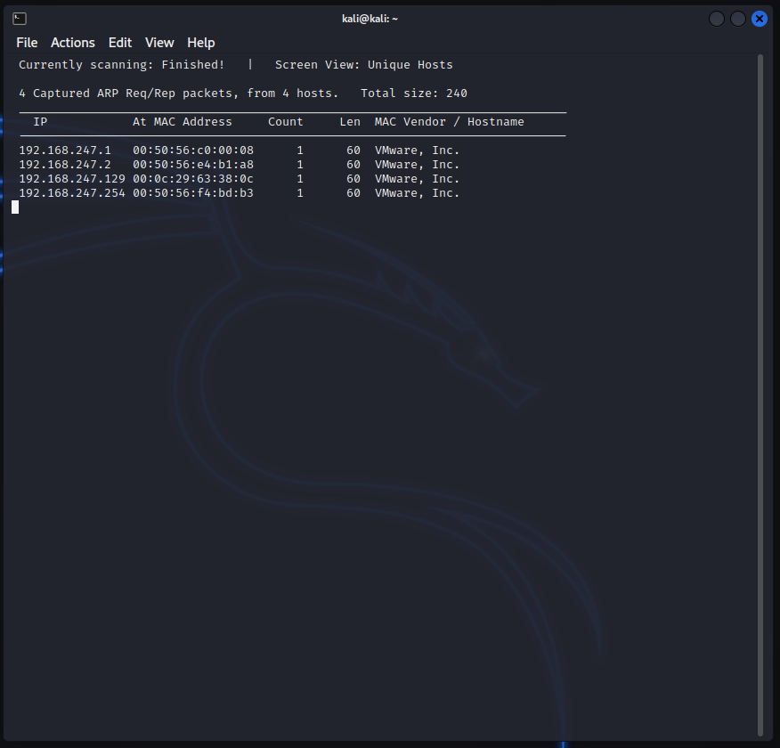

# Scan and Enum (kioptrix lvl1)

Obtain VM from www.vulnhub.com 
 
a great resourecs for vuln VMs 
 
identify attacker IP  
ifconfig or ip -a 
192.168.247.128 
 
conduct an arp scan to scan network for potential victim IPs 
arp-scan -l 
Note: may have to use sudo 
 
will return all systems on network. Exclude .1,.2,.254 and attacker IP. 
potenital victim - 192.168.247.129 
 
 
 
OR 
 
use netdiscover 
netdiscover -r &lt;ip&gt; (192.168.247.0/24)  
again requires root. use Sudo 
 
-192.168.247.129 
 
 
 
 
NMAP SCAN (network mapper) 
scans for open ports and services 
 
nmap -T4 -p- -A 192.168.247.129 
 
-sS stealth scan &gt; it is not 
 
-T4 = speed 1-5 
-p- = ports -p- all ports. exclude for top 1000 
good idea to scan all ports to ensure services not missed 
can also list specific ports 
-A give me all the info.. eveything 
 
 
 
outputs open ports, serivces being run and version numbers if possible. Gives system info include OS with a certainty percentage 
 
ENUMERATING PORTS 
 
HTTP and SMB! historically bad 
 
PORTs 80 and 443 
 
start by checking the IP in a browser both https and http 
 
 
Default web page. no idetifiable purpose. Posssible poor hygine. 
provides info - running apache. Powerd by redhat linux.  
clicking links givves 404 page with further info discloures. Apache version 
 
 
 
NIKTO WEB VULNERABILITY SCANNER 
 
is loud &gt; good security will block it. 
 
syntax &gt; nickto -h (host) http(s):// &lt;ip&gt; 
 
if https doesnt work try http 
 
 
outdated services are a finding to be notated on report. More outdated, more severe. 
results could indicate potential vulnerabilities that can be exploited. 
 
ALSO porivdes basic dir busting. provides some basic directories that may be vulnetrable. 
biggest find is the potential RCE. 
<b>mod_ssl/2.8.4 - mod_ssl 2.8.7 and lower are vulnerable to a remote buffer overflow which may allow a remote shell. http://cve.mitre.org/cgi-bin/cvename.cgi?name=CVE-2002-0082, OSVDB-756.</b> 
 
 
DIRECTORY ENUMERATION 
tool options 
dirb 
dirbuster &gt; Heath prefered 
gobuster 
 
DIRBUSTER 
syntax &gt; dirbuster&amp; 
opens a GUI. 
enter target URL &gt; http(s)://&lt;ip&gt;:&lt;port&gt;/ 
 
select go faster to use more threads 
 
choose a word list from usr &gt; share &gt; dirbuster folder 
 
 
in file extension. lists all the extension to look for. NOTE will increase time to scan as each extension is scanned for ever word in the list. 
admin.php 
admin.txt 
admin.zip 
admin.rar etc 
 
 
 
once scan finished... enumerate ALL the pages looking for useful info. 
 
ENUMERATING SMB PORT 139 
 
from nmap &gt; 139/tcp  open netbios-ssn Samba smbd (workgroup: MYGROUP) 
 
METASPLOIT 
 
syntax &gt; msfconsole 
is a framework 
 
can use 'search' to find exploits and modules 
we ahve SMB so find a module to ID SMB version 
 
seach smb = 125 results 
 
search smb version = 14 results 
 
auxiliary/scanner/smb/smb_version 
 
to use the module  
syntax &gt; use &lt;module&gt; 
use auxiliary/scanner/smb/smb_versio<b>n 
</b><b> 
</b> 
entering options will show required and option details 
 
use set &lt;field&gt; to set options 
syntax set RHOST &lt;ip&gt; 
 
 
 
msf6 auxiliary(scanner/smb/smb_version) &gt; options 
 
Module options (auxiliary/scanner/smb/smb_version): 
 
 Name   Current Setting Required Description 
 ----   --------------- -------- ----------- 
 RHOSTS          yes    The target host(s), see https://github.com/rapid7/metasploit-framework/wiki/Using-Metasplo 
                   it 
 THREADS 1        yes    The number of concurrent threads (max one per host) 
 
msf6 auxiliary(scanner/smb/smb_version) &gt; set RHOSTS 192.168.247.129 
RHOSTS =&gt; 192.168.247.129 
msf6 auxiliary(scanner/smb/smb_version) &gt; run 
 
[*] 192.168.247.129:139  - SMB Detected (versions:) (preferred dialect:) (signatures:optional) 
[*] 192.168.247.129:139  -  Host could not be identified: Unix (Samba 2.2.1a) 
[*] 192.168.247.129:   - Scanned 1 of 1 hosts (100% complete) 
[*] Auxiliary module execution completed 
 
returned a version number for SMB &gt; 2.2.1a 
 
SMBCLIENT &gt; will atempt to connect to file share. this will test the ability to connect anomoys access. if can connect. we can look through files for infomation. 
 
syntax &gt; smbclient -L (list out files) \\\\&lt;ip&gt;\\ (additional slashes are for character escaping in linux. 
 
 
if prompted for password. Just hit enter 
still provided information on fileshares... 2 of them 
IPC$ 
ADMIN$ 
 
ENUMERATE IT 
retry command... remove -L (list) and append the fileshares 
 
denied.. but tried 
 
SSH ENUMERATION 
 
from nmap &gt; 22/tcp  open ssh     OpenSSH 2.9p2 (protocol 1.99) 
 
enumerating is difficult because its close to exploitaiton... a single password guess is no longer enumeration. 
 
attempt to connect all the way up to password request (if exists) do not enter a password... we a re looking for a banner and thus information disclosure. 
 
RESEARCHING THE VULNERABILITES 
Google!!! start googleing!!! 
 
 
port 80/443 
80/tcp  open http    Apache httpd 1.3.20 ((Unix) (Red-Hat/Linux) mod_ssl/2.8.4 OpenSSL/0.9.6b) 
<b>mod_ssl/2.8.4 - mod_ssl 2.8.7 and lower are vulnerable to a remote buffer overflow which may allow a remote shell. http://cve.mitre.org/cgi-bin/cvename.cgi?name=CVE-2002-0082, OSVDB-756.</b> 
 
Google &gt; <b>mod_ssl/2.8.4</b>exploit 
exploit DB 
https://www.exploit-db.com/exploits/764 
 
Github alternate  
https://github.com/heltonWernik/OpenLuck 
 
Google &gt; Apache httpd 1.3.20 exploit 
exploit DB 
https://www.exploit-db.com/exploits/19975 
 
port 139 (SMB) 
139/tcp  open netbios-ssn Samba smbd (workgroup: MYGROUP) 
Unix (Samba 2.2.1a) 
 
Google &gt; Samba 2.2.1a exploit 
exploit DB 
https://www.exploit-db.com/exploits/10 
https://www.exploit-db.com/exploits/7 
 
rapid 7 (metasploit) 
https://www.rapid7.com/db/modules/exploit/linux/samba/trans2open/ 
NOTE 
Description 
 
This exploits the buffer overflow found in Samba versions 2.2.0 to 2.2.8. This particular module is capable of exploiting the flaw on x86 Linux systems that do not have the noexec stack option set. NOTE: Some older versions of RedHat do not seem to be vulnerable since they<b>apparently do not allow anonymous access to IPC</b> 
WE tested and DID have anon access to IPC. CHECK! 
 
 
Port 22 (SSH) 
22/tcp  open ssh     OpenSSH 2.9p2 (protocol 1.99) 
 
 
ALTERANTE RESEARCH TOOL &gt;&gt;&gt;&gt; SEARCHSPOLIT 
dont be too specific 
syntax &gt; searchsploit &lt;info&gt; 
searchsploit samaba 2.2 
 
Can use for validation or if google not available 
 
 
 
BIG RANDOM NOTE&gt;&gt;&gt;&gt; NESSUS 
web app vulnerability scanner... downlaod create account.. set up and run.. get results... 
follow online guides as required. 
 
Once scanned.. ungroup 
start with critical and move down list 
look for things that are exploitable 
look for common themes IE insufficient patching 
you can export the nessus file and use otehr tools to tunr to pretty excel for client. 
ALWAYS verify, do not take scan as gossple 
 
 
 
