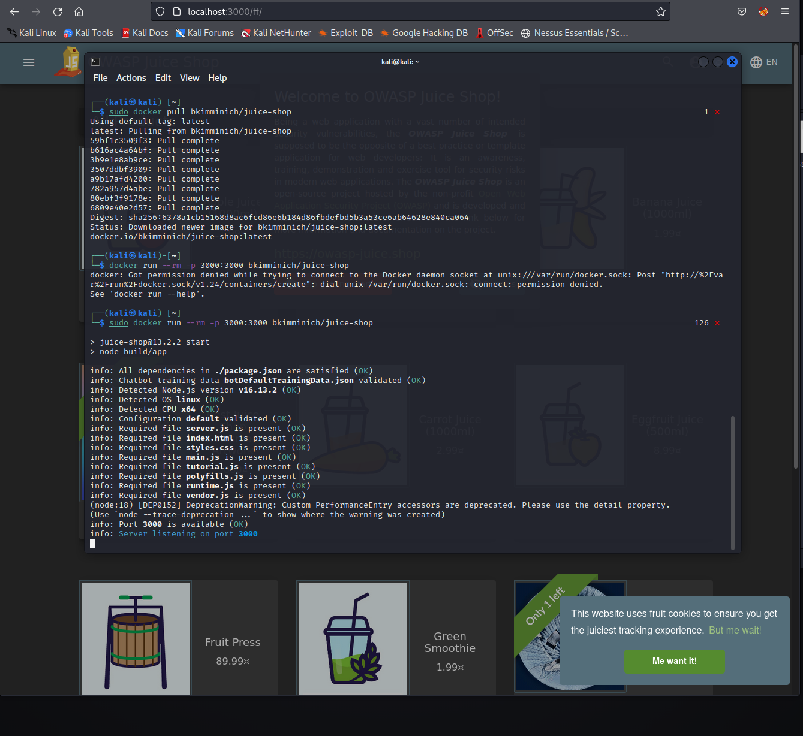

<!DOCTYPE html  PUBLIC '-//W3C//DTD XHTML 1.0 Transitional//EN'  'http://www.w3.org/TR/xhtml1/DTD/xhtml1-transitional.dtd'><html xmlns="http://www.w3.org/1999/xhtml">
<head>
<meta content="text/html; charset=utf-8" http-equiv="Content-Type"/>
<title>Introduction</title>
</head><body>INTRODCUTION 
 
https://owasp.org/www-project-web-security-testing-guide/assets/archive/OWASP_Testing_Guide_v4.pdf 
 
https://owasp.org/www-pdf-archive/OWASP_Top_10-2017_%28en%29.pdf.pdf 
 
 
CHECKLIST 
https://github.com/tanprathan/OWASP-Testing-Checklist 
 
 
Open Web Application Security Project 
 
https://owasp.org/ 
 
the go to for webapp testing 
 
All the resources to attack and defend webapps 
 
Top 10 change year and are considered the most critical 
 
For real worl... you need to know how the attack works, but also how to defend against it. 
 
 
You can use the checklist .xls WITH the OWASP testing guide PDF and move line by line to conduct a deep assessment 
 
 
 
 
 
INSTALLATIONS 
 
https://pwning.owasp-juice.shop/ 
 
OWASP JUICESHOP 
install docker - https://airman604.medium.com/installing-docker-in-kali-linux-2017-1-fbaa4d1447fe 
 
https://github.com/juice-shop/juice-shop 
 
Follow docker install instructions 
docker pull bkimminich/juice-shop 
docker run --rm -p 3000:3000 bkimminich/juice-shop		&gt;&gt;&gt; to run 
http://localhost:3000 
 
 
 
guide???? 
https://github.com/juice-shop/pwning-juice-shop 
 
 
FOXY PROXY 
 
BURP SUITE 
 
 
 
SCOREBOARD 
 
 
 
 
Broad methodology 
Enumerate site as no logged in user 
Enumerate as logged in user 
enumerate as admin 
 
Trying to do things with each level user that shouldnt be available at that level. 
 
 
 
 
 
 
 
 
</body></html>