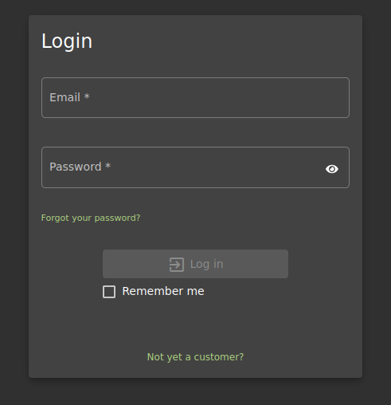

<!DOCTYPE html  PUBLIC '-//W3C//DTD XHTML 1.0 Transitional//EN'  'http://www.w3.org/TR/xhtml1/DTD/xhtml1-transitional.dtd'><html xmlns="http://www.w3.org/1999/xhtml">
<head>
<meta content="text/html; charset=utf-8" http-equiv="Content-Type"/>
<title>SQL Injection</title>
</head><body>SQL INJECTION ---- OWASP JUICE SHOP 
 
An attack where malicious SQL statements are injected into a SQL database 
 
Can disclose senstive information from the database. Modify the database.. potentiall get a shell 
 
 
 
Statements 
 
SELECT - get data from table 
INSERT - INsert date into table 
DELETE - remove data from table 
UPDATE - Modiy data in a table 
DROP - Delete a table 
UNION - Combines data from multiple queries 
WHERE - Filter based on proivided info 
AND/OR/NOT - Filter based opn multiple conditons 
ORDER BY - Sort resultes 
* - wild care 
' and &quot; - string delimiters 
--, /* and # comments 
* and % wild cards 
; - End statement 
 
SELECT * FROM Users; 
 
Note - when not getting an error responce, you could be facing a case of blind SQL injection.  
inject sleep commands and see if the site processes it. 
input: test' (sleep 10) 
 
ATTACK 
 
Navigate to the login portal 
 
 
 
Run burp suite and direct traffic through the proxy 
 
plug in some test data and intercept the request 
 
 
 
 
Send it to repeater and submit data again to capture responce for analysis 
 
 
Responce ! 
Invalid email or password. 
 
add a ' to test email and check for responce. Trying to identify is field is vulnerable to sql injection 
 
This returned an error which provides additional details that can be used to craft further attacks. 
 
 
 
 
 
SQLITE_ERROR - SQLite  
 
&quot;SELECT * FROM Users WHERE email = 'test'' AND password = '098f6bcd4621d373cade4e832627b4f6' AND deletedAt IS NULL&quot; 
 
Can be user to craft injections 
 
Login in as ADMIN.... admin account is usuall the first account.. account 0 or 1 
 
using the added ' we can break the first pat of the syntax then include an alway true statement 
 
&quot;SELECT * FROM Users WHERE email = 'test'<b>' OR 1=1; --</b><i>AND password = '098f6bcd4621d373cade4e832627b4f6' AND deletedAt IS NULL&quot; (All of this gets ignored)</i> 
 
 
this grants Admin and completes thee challange 
 
 
 
 
DEFENCES 
 
Parameterised Statements 
ensures that inputs are passed through safely. Only accepts what is expected 
 
Sanitising Input 
dont allow unneccesarry characters IE ' and OR and 1=1 
 
 
 
</body></html>