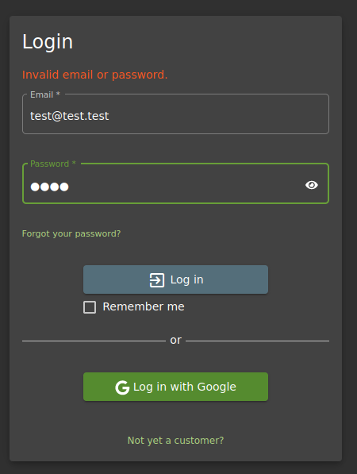

<!DOCTYPE html  PUBLIC '-//W3C//DTD XHTML 1.0 Transitional//EN'  'http://www.w3.org/TR/xhtml1/DTD/xhtml1-transitional.dtd'><html xmlns="http://www.w3.org/1999/xhtml">
<head>
<meta content="text/html; charset=utf-8" http-equiv="Content-Type"/>
<title>Broken Authentication</title>
</head><body>Broken Authentication ---- OWASP JUICE SHOP 
 
Information on how to test, how to prevent end exmaples here 
https://owasp.org/www-project-top-ten/2017/A2_2017-Broken_Authentication.html 
 
 
TESTING 
 
go to the login page as an unauthenticated user and enter some test date. 
 
As expected it returns Invalid email OR password 
NOTE - This is good.. if the error message only gave 1 error field, it could be considered information disclosuire and count as a low level finding. 
 
 
 
 
navigating to the forgot password page allows a password reset in the page. this is dangerous. 
Also the secruity question field does not become interactive UNTIL a VALID email address that exists is entgered. This is the equivilant to the error message returning invalid email. THis can be used for UID enumeration.  
Poor secruitiy question.. &quot;motehrs maiden name&quot; OSINT could easliy answer that. 
 
 
 
 
Now we will create a user account and test for token fixation. IE does the token rotate and expire or is it a fixed value 
 
1. create user account 
 
Refresh page. there should be no tokens when no user logged in 
 
login and intercept the traffic... 
a token is created. Send it to repeater 
 
refreshing the page maintains the same token 
 
first major test . log out and see if token persists when page is refreshed 
no token - good... 
 
now use the saved rtepeater request to try and gain access with the token 
304! 
appears to expire - good 
 
now log back in and see if you get a new token 
 
<i>TOKEN 1 -  
</i><i>token=eyJ0eXAiOiJKV1QiLCJhbGciOiJSUzI1NiJ9.eyJzdGF0dXMiOiJzdWNjZXNzIiwiZGF0YSI6eyJpZCI6MjIsInVzZXJuYW1lIjoiIiwiZW1haWwiOiJ0ZXN0QHRlc3QuY29tIiwicGFzc3dvcmQiOiIxNmQ3YTRmY2E3NDQyZGRhM2FkOTNjOWE3MjY1OTdlNCIsInJvbGUiOiJjdXN0b21lciIsImRlbHV4ZVRva2VuIjoiIiwibGFzdExvZ2luSXAiOiIwLjAuMC4wIiwicHJvZmlsZUltYWdlIjoiL2Fzc2V0cy9wdWJsaWMvaW1hZ2VzL3VwbG9hZHMvZGVmYXVsdC5zdmciLCJ0b3RwU2VjcmV0IjoiIiwiaXNBY3RpdmUiOnRydWUsImNyZWF0ZWRBdCI6IjIwMjItMDMtMjAgMTE6NTU6MzYuNzIwICswMDowMCIsInVwZGF0ZWRBdCI6IjIwMjItMDMtMjAgMTE6NTU6MzYuNzIwICswMDowMCIsImRlbGV0ZWRBdCI6bnVsbH0sImlhdCI6MTY0Nzc3NzM0NiwiZXhwIjoxNjQ3Nzk1MzQ2fQ.WYb_g5VMiW3Qo6D6-YBUqJDKq53xAmvMHhTOVVeal_uqXz1fRxuWdpSVhrHO9VzSAhBi2WNRE0RIS0h4jM8wpupWES-e1kYuViMrQoHlY7HUnXP0isVYkQ-MZaQ4266hn9FN-liMtH0mA_DxAT6-yI7OTf1gpHUFuiRecPJNQKQ</i> 
 
<i>TOKEN 2- 
</i><i>token=eyJ0eXAiOiJKV1QiLCJhbGciOiJSUzI1NiJ9.eyJzdGF0dXMiOiJzdWNjZXNzIiwiZGF0YSI6eyJpZCI6MjIsInVzZXJuYW1lIjoiIiwiZW1haWwiOiJ0ZXN0QHRlc3QuY29tIiwicGFzc3dvcmQiOiIxNmQ3YTRmY2E3NDQyZGRhM2FkOTNjOWE3MjY1OTdlNCIsInJvbGUiOiJjdXN0b21lciIsImRlbHV4ZVRva2VuIjoiIiwibGFzdExvZ2luSXAiOiJ1bmRlZmluZWQiLCJwcm9maWxlSW1hZ2UiOiIvYXNzZXRzL3B1YmxpYy9pbWFnZXMvdXBsb2Fkcy9kZWZhdWx0LnN2ZyIsInRvdHBTZWNyZXQiOiIiLCJpc0FjdGl2ZSI6dHJ1ZSwiY3JlYXRlZEF0IjoiMjAyMi0wMy0yMCAxMTo1NTozNi43MjAgKzAwOjAwIiwidXBkYXRlZEF0IjoiMjAyMi0wMy0yMCAxMTo1ODoyOS40NTggKzAwOjAwIiwiZGVsZXRlZEF0IjpudWxsfSwiaWF0IjoxNjQ3Nzc3NjIzLCJleHAiOjE2NDc3OTU2MjN9.kH5r35UwJ6D1k0_vaecOfR79LTum3pTdk-jSY8mwYXdc8fBvH8DY-MOiEhQYyi2fvAWgB0TAFtUEc7UUglMh8TU45bcZaer8X6CXKnP_a3nIMveuFsXAycGqBoNj-h-MfZ_nn0PjW0F-KK7w9pFTNZ7WuxugoJccWoZCB2oeFp8</i> 
 
Good! 
 
Further attacks are to continue to try and exploit the limited validation and reset users passwords, taking over accounts 
 
 
 
 
 
 
 
 
 
 
 
 
</body></html>