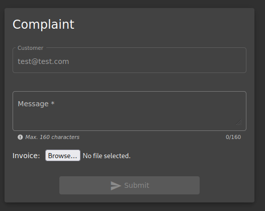

<!DOCTYPE html  PUBLIC '-//W3C//DTD XHTML 1.0 Transitional//EN'  'http://www.w3.org/TR/xhtml1/DTD/xhtml1-transitional.dtd'><html xmlns="http://www.w3.org/1999/xhtml">
<head>
<meta content="text/html; charset=utf-8" http-equiv="Content-Type"/>
<title>XML External Entities (XXE)</title>
</head><body>XXE ---- OWASP JUICE SHOP 
 
 
Can be used for things liike DOS, RCE, info disclosre etc 
 
google XXE payloads... thats fine 
https://github.com/payloadbox/xxe-injection-payload-list 
 
<b>https://github.com/swisskyrepo/PayloadsAllTheThings 
</b> 
 
XXE attacks systems that parse XML input 
 
 
ATTACK 
 
XXE wont run in docker... RIP 
 
Methodology 
 
Create a malicious file 
 
 
&lt;?xml version=&quot;1.0&quot; encoding=&quot;ISO-8859-1&quot;?&gt;  
	&lt;!DOCTYPE foo [ <ul><li style="list-style-type: none">&lt;!ELEMENT foo ANY &gt; </li>
</ul>
	&lt;!ENTITY xxe SYSTEM &quot;file:///etc/passwd&quot; &gt;]&gt;&lt;foo&gt;&amp;xxe;&lt;/foo&gt; 
 
call it something.xml &gt; save it somehjwere accesible 
 
 
navigate to login page &gt; login as user (creaate account if required) 
 
NOTE - this is called authenticatred testing &gt;&gt;&gt; IE we are currently an authenticated user or middle level user 
Normally you would now click around and see what you ahve access to and can do. 
Burp suite pro can crawl through a website for you.,. 
 
User can upload files 
 
 
 
an upload feature should restrict file types and enforce it... First test that it works... then we test bypass the restriction 
 
 
BUrp should be running but we are going to try upload the malicious file and intercept the submission to check the responce. 
Note when trying to upload the file may not be vissible... this is a feature of &quot;all supported types&quot; being selected. This also indicated what the system is expecting to receive. 
Just change it to &quot;all files&quot; 
 
 
 
 
 
 
 
Capture submission with BURP and send to repeater for replayability 
 
 
 
No restriction so we are able to upload and run the malicious XML file... IF &gt;&gt;&gt; IF it worked in docer it would output the etc/passwd file contents to the responce... 
 
Any partially successfull attack can be submitted as a finding as it is still evidence of vulnerability! you dont need to fully exploit it. 
The ability to bypass the file type &quot;white listing&quot; is also a finding to be submitted 
 
WHY  
External entities are being parsed 
 
DEFENSE 
 
Disable DTTDs Disable external entities. 
 
 
 
 
 
 
 
 
</body></html>