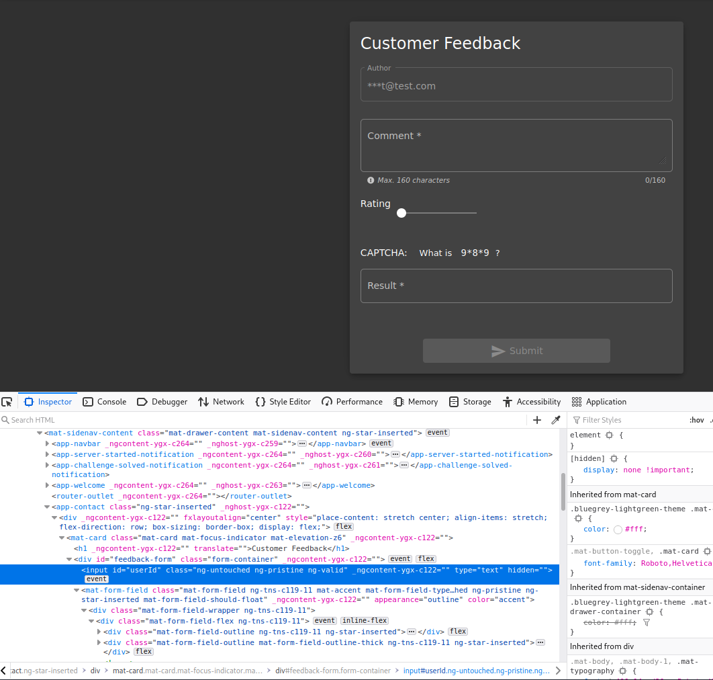

<!DOCTYPE html  PUBLIC '-//W3C//DTD XHTML 1.0 Transitional//EN'  'http://www.w3.org/TR/xhtml1/DTD/xhtml1-transitional.dtd'><html xmlns="http://www.w3.org/1999/xhtml">
<head>
<meta content="text/html; charset=utf-8" http-equiv="Content-Type"/>
<title>Broken Access Control</title>
</head><body>BROKEN ACCESS CONTROL ---- Juice Shop 
 
Info about the what why and how 
https://owasp.org/www-project-top-ten/2017/A5_2017-Broken_Access_Control.html 
 
 
What &gt; accessing things you should not have access to... IDORs (Insecure Direct Object Reference 
 
Bypassing access 
 
Testing to enusre users can not access things they should not have access to 
 
ATTACK 
 
First attack login as a user. 
We will leave feedback for a differnt user 
 
Navigate to customer feedback... you will note that the author is pre geeenerated and not interactable.. also partially hidden 
 
use inspect element  
 
look for the div containing this value and note that is &quot;hidden&quot; 
 
These fields can be modified &gt; reverts when page reloaded 
 
 
 
 
Delete teh hidden and it should expose the true value of the field 
 
The hidden detail was a user ID &gt; this can also now be interacted with and modified.. MY ID was 21... 1 will be ADMIN... 
 
 
 
 
 
 
 
 
 
 
NOTE be a lower level and try all the things a higer level should be able to do include dirb them hidden directories 
 
 
 
 
 
 
 
</body></html>