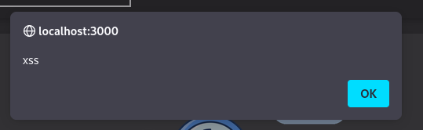

<!DOCTYPE html  PUBLIC '-//W3C//DTD XHTML 1.0 Transitional//EN'  'http://www.w3.org/TR/xhtml1/DTD/xhtml1-transitional.dtd'><html xmlns="http://www.w3.org/1999/xhtml">
<head>
<meta content="text/html; charset=utf-8" http-equiv="Content-Type"/>
<title>Cross-Site Scripting (XSS)</title>
</head><body>CROSS-SITE SCRIPTING (XSS) --- Juioce Shop 
 
 
OVERVIEW 
 
Resources 
https://owasp.org/www-project-top-ten/2017/A7_2017-Cross-Site_Scripting_(XSS).html 
https://www.scip.ch/en/?labs.20171214 
https://xss-game.appspot.com/ 
 
 
***Copied from OWASP*** 
There are three forms of XSS, usually targeting users’ browsers: 
 
* Reflected XSS: The application or API includes unvalidated and unescaped user input as part of HTML output. A successful attack can allow the attacker to execute arbitrary HTML and JavaScript in the victim’s browser. Typically the user will need to interact with some malicious link that points to an attacker-controlled page, such as malicious watering hole websites, advertisements, or similar. 
 
* Stored XSS: The application or API stores unsanitized user input that is viewed at a later time by another user or an administrator. Stored XSS is often considered a high or critical risk. 
 
* DOM XSS: JavaScript frameworks, single-page applications, and APIs that dynamically include attacker-controllable data to a page are vulnerable to DOM XSS. Ideally, the application would not send attacker-controllable data to unsafe JavaScript APIs. 
Typical XSS attacks include session stealing, account takeover, MFA bypass, DOM node replacement or defacement (such as trojan login panels), attacks against the user’s browser such as malicious software downloads, key logging, and other client-side attacks. 
 
 
Note - reflected and DOM are client site and not stored.. Stored... stored on the application &gt; everyu time that page is loaded it runs... 
 
reflected and DOM require some kind of user interaction to run... DOM does not. if the user navigates to the page it will run 
 
 
 
Thankgs we can do... 
 
Steal Cookies - Yum 
DOS 
deface website 
create pop ups 
 
 
REFLECTED XSS 
 
NOTE - BURP is good at finding Reflected XSS &gt; it can crawl.. you need pro.. without it Manual.. Nessus?? 
 
Basically get a simple XXS command and test it around all the iput fields and see if you get a pop up 
 
&lt;iframe src=&quot;javascript:alert(`xss`)&quot;&gt; 
&lt;script&gt;alert(`xss`)&lt;/script&gt; 
 
Check for stored... check for pop up (Success) check if there is trimming or sanitisation. you mihght need to obsfucate 
 
 
 
The XSS challanges dont work properly in docker 
 
 
Get a popup!!! nothing is stored 
 
 
 
STORED XSS 
 
Stored XSS is very dangerous &gt; can steal user cookies and impoersonate OR steal admin!!! These are always a finding and good for bug bounties 
 
Again grab a simple test payload 
 
&lt;script&gt;alert(`xss`)&lt;/script&gt; 
 
NOTE &gt;&gt;&gt; Docker Jucieshop doesnt allow XSS challanges 
 
In this case... obsufucation might be needed to bypass sanitisation 
 
https://portswigger.net/web-security/cross-site-scripting/cheat-sheet 
 
https://github.com/payloadbox/xss-payload-list/blob/master/Intruder/xss-payload-list.txt 
 
https://github.com/pgaijin66/XSS-Payloads/blob/master/payload/payload.txt 
 
 
 
 
DEFENSE 
 
Encoding &gt; convert control chars to escape sequence  
&lt; become &amp;lt 
&lt;script&gt; becomes &amp;lt;script&gt; 
 
Filtering &gt; remove tags 
&lt;script&gt; becomes script 
 
Validating &gt; check input vs a white list 
 
Sanitisation &gt; Combination of all above 
 
 
HTTP only flags and secure headers can defend against stealling cookies with XSS 
 
 
 
 
</body></html>