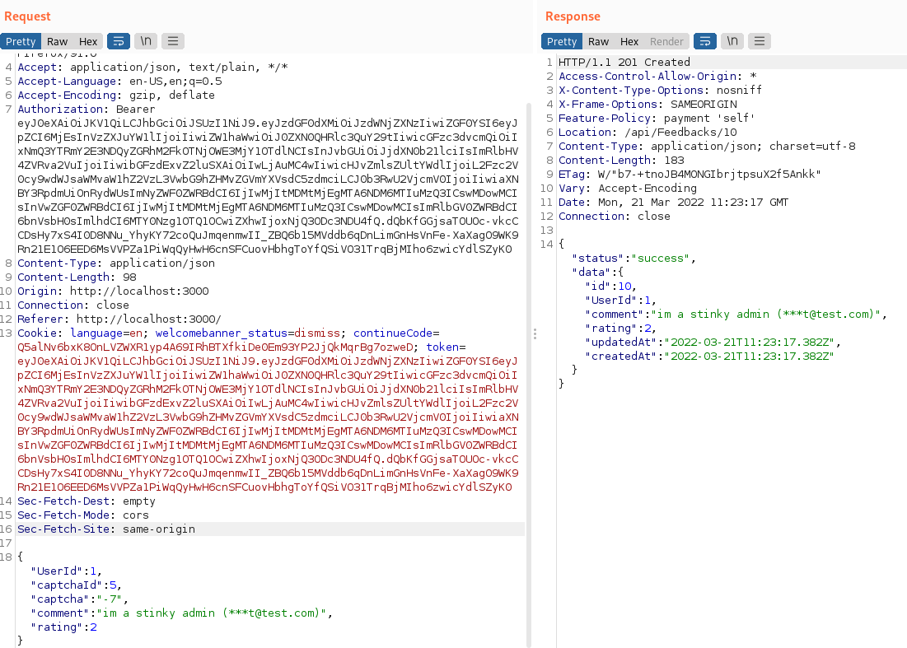

<!DOCTYPE html  PUBLIC '-//W3C//DTD XHTML 1.0 Transitional//EN'  'http://www.w3.org/TR/xhtml1/DTD/xhtml1-transitional.dtd'><html xmlns="http://www.w3.org/1999/xhtml">
<head>
<meta content="text/html; charset=utf-8" http-equiv="Content-Type"/>
<title>Security Missconfiguration</title>
</head><body>SECURITY MISSCONFIGURATION - Juice Shop 
 
Data alot 
https://owasp.org/www-project-top-ten/2017/A6_2017-Security_Misconfiguration.html 
 
IE - Default creds! 
 
Error handling!!! dont give away that info &gt; dont give detailed error ahndling to users 
 
Dont use features you dont need.. they may be vulnerable 
 
Allowing things that shouldnt be... uploading oncorrect file types 
 
Its a catch all if you misconfigure something or dont restrict to whats required... its missconfigured 
 
 
ALTERNATE &gt;&gt;&gt; use burp... intecept and modify 
 
 
 
 
oops &gt;&gt; looks like the admin doesnt like Apple juice 
 
 
 
 
</body></html>